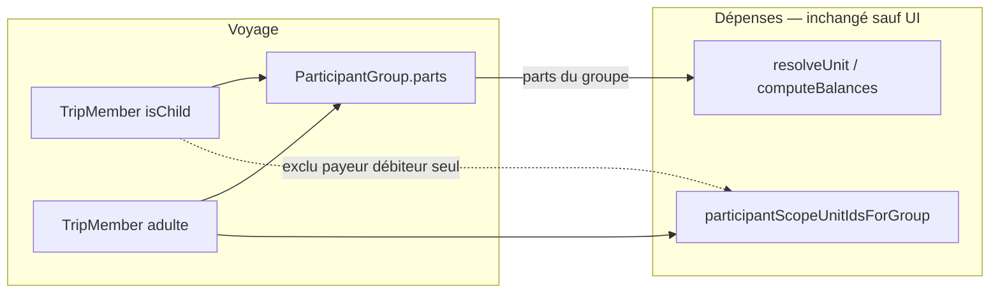

# Plan : participants « enfant »

## Contexte produit (validé)

- Un **enfant** est un `TripMember` sans compte (jamais revendiqué via invitation).
- Il **n’apparaît jamais** comme payeur / débiteur individuel dans les dépenses (même s’il n’est dans aucun groupe de facturation).
- Il peut figurer dans un **groupe de facturation** (`participantGroups`). Lors de la sélection des membres dans l’éditeur de groupe, le champ **Parts** se préremplit avec une **suggestion** : **0,5 par enfant + 1 par adulte**. L’admin peut **modifier librement** cette valeur ; c’est **`group.parts`** (tel qu’enregistré) qui entre en compte dans le calcul des dépenses — **aucun autre changement** dans l’écosystème dépenses / équilibres / règlement.
- Le **badge** affiche toujours l’icône enfant + la première lettre du nom (pas de photo).



---

## Principe clé : périmètre dépenses

| Zone | Impact |
|------|--------|
| **UI dépenses** | Exclure les `isChild` des unités individuelles (listes payé par / participants / scope ungrouped) |
| **Éditeur groupes** | Suggestion initiale du champ Parts lors de la sélection de membres (0,5 / enfant, 1 / adulte) ; auto-sync tant que l’admin n’a pas personnalisé |
| **Calcul settlement** | **Aucun changement** — `functions/expense_settlement.js`, `expense_settlement_recalc.js`, `scripts/expense_settlement.js`, `resolveUnit`, soldes, suggestions de remboursement |
| **Modèle `ParticipantGroup`** | **Aucun changement** — seul le champ `parts` existant, saisi (ou suggéré) par l’admin |

---

## 1. Modèle de données

**Fichier principal :** [`lib/features/trips/data/trip_member.dart`](lib/features/trips/data/trip_member.dart)

- Ajouter `bool isChild` (défaut `false`).
- Firestore : champ booléen `isChild` (absent ou `false` = adulte pour rétrocompatibilité).
- Mettre à jour `fromMap`, `toMap`, `copyWith`.
- **Pas** de champ `parts` ou poids de facturation au niveau du membre — le 0,5 n’existe que comme suggestion UI dans l’éditeur de groupes.

---

## 2. Création / modification (UI)

### Ajout d’un voyageur prévu

[`lib/features/trips/presentation/trip_participants_page.dart`](lib/features/trips/presentation/trip_participants_page.dart) — `_openAddDialog` :

- Ajouter un `SwitchListTile` (ou équivalent) avec `Icons.child_care` + libellé l10n.
- Transmettre `isChild` à `TripsRepository.addTripParticipant`.

### Édition du nom

[`lib/features/trips/presentation/trip_participant_name_dialog.dart`](lib/features/trips/presentation/trip_participant_name_dialog.dart) :

- Étendre `TripParticipantNameDialogResult` avec `isChild`.
- Afficher le switch **uniquement si** `!isClaimed` (règle : pas de compte derrière un enfant).
- Propager dans `_openEditParticipantDialog` et `updateTripParticipantName`.

### Repository & Cloud Function

- [`lib/features/trips/data/trips_repository.dart`](lib/features/trips/data/trips_repository.dart) : paramètre `isChild` sur `addTripParticipant` et `updateTripParticipantName` ; persistance Firestore.
- [`functions/index.js`](functions/index.js) — `addTripParticipant` : accepter `isChild` (bool), écrire sur le document créé.
- **Optionnel mais cohérent :** ne pas appeler `addParticipantIdToDefaultExpensePost` pour un enfant (inutile pour la visibilité d’un slot sans compte).

### Règles Firestore

[`firestore.rules`](firestore.rules) — `match /participants/{participantId}` :

- Autoriser `isChild` à la création (CF) et à la mise à jour côté gestionnaires, dans les ensembles de clés autorisées (`update` actuellement limité à `participantName` / `useProfileName`).

---

## 3. Badge profil (icône + initiale)

**Fichier central :** [`lib/features/auth/presentation/profile_badge.dart`](lib/features/auth/presentation/profile_badge.dart)

- Paramètre `bool isChild = false` sur `buildProfileBadge`.
- Si `isChild` : **ignorer** `userData` / photo ; fallback dédié = cercle existant + `Stack` ou `Column` avec `Icons.child_care` (taille ~35 % du badge) + `avatarInitialFromDisplayLabel(displayLabel)` (même typo que l’adulte sans photo).

**Câblage prioritaire :**

- [`trip_participants_page.dart`](lib/features/trips/presentation/trip_participants_page.dart) — `_participantRoleLeading` : passer `row.member.isChild`.
- Autres appels `buildProfileBadge` liés à un `TripMember` : au minimum [`chat_widget.dart`](lib/features/messaging/presentation/chat_widget.dart), repas, activités, covoiturage, jeux — en passant `isChild` quand le membre est connu.

**Hors scope immédiat :** [`trip_overview_page.dart`](lib/features/trips/presentation/trip_overview_page.dart) — bandeau d’aperçu à aligner plus tard si besoin.

---

## 4. Dépenses : seul impact = ne pas afficher les enfants comme payeur / débiteur

**Fonction clé :** `participantScopeUnitIdsForGroup` dans [`lib/features/expenses/presentation/trip_expenses_page.dart`](lib/features/expenses/presentation/trip_expenses_page.dart)

```dart
final ungrouped = participants
    .where((m) =>
        !m.isChild &&
        allowed.contains(m.id) &&
        !groupedMemberIds.contains(m.id))
    ...
```

- Les **groupes** dont tous les membres sont visibles sur le poste restent éligibles même s’ils contiennent un enfant (l’unité facturée est l’**id du groupe**, pas l’enfant).
- Les écrans « payé par » / participants consomment déjà `participantScopeMemberIds` — filtrage suffisant côté client.

**Explicitement hors scope (ne pas modifier) :**

- [`functions/expense_settlement.js`](functions/expense_settlement.js) — `resolveUnit`, `computeBalances`, `participantSharesForExpense`
- [`functions/expense_settlement_recalc.js`](functions/expense_settlement_recalc.js)
- [`scripts/expense_settlement.js`](scripts/expense_settlement.js)
- Logique `groupParts[id] ?? 1.0` dans [`trip_expenses_page.dart`](lib/features/expenses/presentation/trip_expenses_page.dart) pour le split égal — inchangée ; elle lit déjà `ParticipantGroup.parts`

---

## 5. Groupes de facturation : suggestion 0,5 (UI uniquement)

[`trip_participants_page.dart`](lib/features/trips/presentation/trip_participants_page.dart) — `_GroupEditorDialogState` :

Helper **local à l’éditeur** (pas sur `TripMember` comme poids métier) :

```dart
/// Suggestion for the Parts field when selecting group members.
double suggestedParticipantGroupParts(
  Iterable<String> memberIds,
  Map<String, TripMember> membersById,
) => memberIds.fold(0.0, (sum, id) {
  final m = membersById[id];
  if (m == null) return sum + 1.0;
  return sum + (m.isChild ? 0.5 : 1.0);
});
```

| Comportement actuel | Nouveau |
|---------------------|---------|
| Suggestion initiale = `memberIds.length` (ou 2) | Suggestion = `suggestedParticipantGroupParts(...)` |
| Auto-sync si `parts == oldMemberCount` | Auto-sync si `parts == oldSuggestedSum` (admin a laissé la suggestion ; dès qu’il édite manuellement, ne plus écraser) |

- Le champ **Parts** reste **entièrement éditable** ; validation existante (`> 0`) inchangée.
- À l’enregistrement : toujours `ParticipantGroup.parts` = valeur saisie par l’admin — **source de vérité** pour les dépenses.

Affichage optionnel dans la liste des membres du groupe : icône enfant à côté du libellé.

---

## 6. Invitation / revendication

**Bloquer la revendication d’un slot enfant :**

- [`functions/index.js`](functions/index.js) — `completeJoinTripWithInvite` : si le slot choisi a `isChild === true`, `failed-precondition` avec message clair.
- `getInviteJoinContext` : **exclure** les slots `isChild` de la liste renvoyée au client.
- [`lib/features/trips/presentation/invite_join_page.dart`](lib/features/trips/presentation/invite_join_page.dart) : défense côté client si besoin.

**UI participants :** pas de navigation profil / Cupidon / bascule admin pour `isChild`.

---

## 7. Localisation

Clés ARB (4 fichiers : `app_fr`, `app_fr_FR`, `app_en`, `app_en_US`) — exemples :

- `tripParticipantsIsChildLabel` — « Enfant »
- `tripParticipantsIsChildSubtitle` — courte phrase métier (sans tutoriel superflu)
- SnackBar / erreurs invitation si nécessaire

Regénérer les localisations (`flutter gen-l10n`).

---

## 8. Tests & qualité

- [`functions/expense_settlement.test.js`](functions/expense_settlement.test.js) — **aucun changement**.
- Tests Dart ciblés (si pertinent) : `suggestedParticipantGroupParts`, filtre `participantScopeUnitIdsForGroup`.
- `flutter analyze` après implémentation.

---

## 9. Déploiement (product owner)

Après merge, le PO exécute :

```powershell
firebase deploy --only functions:addTripParticipant,functions:getInviteJoinContext --project <project-id>
firebase deploy --only firestore:rules --project <project-id>
```

(Adapter la liste des fonctions si d’autres exports sont modifiés.)

---

## Fichiers principaux (résumé)

| Zone | Fichiers | Touché ? |
|------|----------|----------|
| Modèle | `trip_member.dart` | Oui (`isChild`) |
| UI participants | `trip_participants_page.dart`, `trip_participant_name_dialog.dart` | Oui |
| Badge | `profile_badge.dart` | Oui |
| Dépenses (UI scope) | `trip_expenses_page.dart` | Oui (filtre ungrouped) |
| Settlement / soldes | `expense_settlement*.js`, recalc | **Non** |
| Données / API | `trips_repository.dart`, `functions/index.js`, `firestore.rules` | Oui |
| i18n | `lib/l10n/app_*.arb` | Oui |
