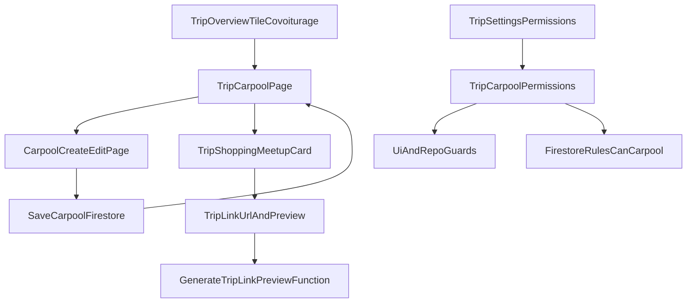

# Plan d’implémentation — Covoiturage (remplacement de `cars`)

## Résumé fonctionnel
- La tuile `cars` de l’aperçu voyage devient la porte d’entrée **Covoiturage**.
- Depuis cette tuile, l’utilisateur accède à une page dédiée qui liste les covoiturages du voyage.
- Cette tuile affiche aussi un rappel personnel: avec quel conducteur l’utilisateur est embarqué, et si ce covoiturage est marqué “va faire les courses”.
- Sur la page covoiturage, un bouton d’action ouvre un **écran de création** (plein écran), jamais une pop-up ni une modale.
- La création/édition d’un covoiturage se fait en **saisie libre** pour:
  - type/marque de la voiture;
  - adresse du point de rendez-vous;
  - point de transport en commun le plus proche.
- L’utilisateur renseigne aussi:
  - le nombre de places disponibles pour ce covoiturage.
  - la date/heure de départ du covoiturage.
- Le conducteur est, par défaut, la personne qui crée le covoiturage.
- Le conducteur peut être changé (ex: un admin crée pour quelqu’un d’autre).
- Le conducteur est toujours identifié visuellement par une icône volant dans la liste des participants du covoiturage.
- En création/édition, la désignation du conducteur se fait via une **combobox avec recherche** sur la liste des participants du voyage.
- Le conducteur compte comme personne embarquée (sa place est prise dans le covoiturage).
- Une voiture peut être constituée avec des voyageurs déjà membres du voyage **et** des voyageurs temporaires/prévus (invités non encore rejoints).
- Un participant ne peut être affecté qu’à **une seule** voiture de covoiturage sur le voyage (ou aucune).
- Le nombre de participants affectés à une voiture ne peut pas dépasser le nombre de places disponibles.
- Quand un voyageur temporaire rejoint effectivement le voyage, la fonctionnalité doit conserver/raccorder automatiquement son affectation covoiturage sans créer de doublon.
- En validation, l’utilisateur revient sur la liste covoiturage avec les informations mises à jour.
- Chaque cartouche covoiturage de la liste affiche:
  - le profil et le nom de la personne qui conduit;
  - un rappel de la voiture;
  - le point de transport en commun le plus proche;
  - un indicateur visuel si la voiture est désignée pour les courses.
- Chaque cartouche propose une action rapide pour ouvrir Google Maps et lancer la navigation vers le point de rendez-vous.
- Le tap sur un cartouche ouvre l’édition du covoiturage; la suppression se fait depuis cet écran (pas de suppression directe en liste).
- En haut de la page covoiturage, un encart d’alerte (style warning) apparaît quand des participants du voyage ne sont affectés à aucune voiture.
- La page contient aussi un encart global “rendez-vous courses” (au niveau du voyage, pas au niveau d’une voiture):
  - saisie d’un lien Google Maps;
  - aperçu du lien (preview);
  - action pour ouvrir Google Maps.
- Plusieurs voitures peuvent être marquées “désignées pour faire les courses” en même temps (ce n’est pas exclusif).
- Droits métier attendus:
  - la personne qui crée un covoiturage garde toujours la main sur son covoiturage (éditer, supprimer, affecter des participants, marquer courses);
  - en plus, les administrateurs/créateur du voyage peuvent intervenir selon les permissions du voyage (“mode admin” par défaut).
- L’expérience visuelle doit rester alignée avec les écrans existants de l’application (notamment repas): structure, sections, titres, espacements, densité d’information et composants.

## Cadrage validé
- La section existante `cars` est remplacée par **covoiturage** (tuile/route/page).
- L’encart “point de rendez-vous courses” est **global au voyage** (pas par voiture).
- Modification de cet encart autorisée à **créateur du voyage + admins**.
- Le créateur du covoiturage dispose d’un droit natif non configurable (édition/suppression/assignation/marquage courses).
- Les permissions du voyage ne pilotent que l’override des autres rôles (mode admin par défaut).

## Lot 1 — Modèle de données et permissions (socle)
- Étendre le modèle permissions dans [`C:/Users/pc_ga/repos/Planzers/lib/features/trips/data/trip_permissions.dart`](C:/Users/pc_ga/repos/Planzers/lib/features/trips/data/trip_permissions.dart) avec un nouveau groupe `carpool` et actions:
  - proposer un covoiturage (par défaut: participant)
  - assigner des passagers (par défaut: admin)
  - marquer “va faire les courses” (par défaut: admin)
  - éditer/supprimer un covoiturage tiers (override “mode admin”, par défaut: admin)
- Étendre [`C:/Users/pc_ga/repos/Planzers/lib/features/trips/data/trip.dart`](C:/Users/pc_ga/repos/Planzers/lib/features/trips/data/trip.dart) pour sérialiser `permissions.carpool`.
- Ajouter les helpers d’autorisation dans [`C:/Users/pc_ga/repos/Planzers/lib/features/trips/data/trip_permission_helpers.dart`](C:/Users/pc_ga/repos/Planzers/lib/features/trips/data/trip_permission_helpers.dart), avec logique propriétaire du covoiturage + admin/créateur quand applicable.
  - Règle prioritaire à implémenter: droit natif du créateur sur son covoiturage (non configurable).
  - Les seuils de permissions voyagent servent uniquement d’override pour les autres rôles.
- Aligner les defaults/backfill côté client + Functions:
  - [`C:/Users/pc_ga/repos/Planzers/lib/features/trips/data/trips_repository.dart`](C:/Users/pc_ga/repos/Planzers/lib/features/trips/data/trips_repository.dart)
  - [`C:/Users/pc_ga/repos/Planzers/functions/index.js`](C:/Users/pc_ga/repos/Planzers/functions/index.js)
- Ajouter le modèle Firestore du covoiturage (sous-collection dédiée sous le voyage) avec champs:
  - `driverUserId`, `vehicleLabel`, `meetingPointAddress`, `nearestTransitStop`, `departureAt`, `availableSeats`, `assignedParticipantIds`, `goesShopping`, timestamps.
  - Invariant métier: `driverUserId` doit toujours être inclus dans `assignedParticipantIds`.
  - La propriété `goesShopping` est indépendante par covoiturage (aucune contrainte d’unicité au niveau voyage).
- Prévoir le stockage d’affectation compatible “membre + temporaire/prévu” avec identifiant stable de rapprochement:
  - permettre qu’un passager soit référencé avant son adhésion effective au voyage;
  - lors du rattachement du temporaire vers un compte membre, migrer/résoudre l’affectation vers l’identité membre sans perte d’information.

## Lot 2 — Guardrails backend et cohérence sécurité
- Étendre [`C:/Users/pc_ga/repos/Planzers/firestore.rules`](C:/Users/pc_ga/repos/Planzers/firestore.rules):
  - fonctions `canCarpool...` alignées sur permissions + exception systématique du créateur du covoiturage sur sa ressource.
  - règles create/update/delete de la sous-collection covoiturage.
  - règles update du champ voyage pour l’encart courses global (admin/créateur).
- Vérifier la cohérence 3 couches pour chaque action: visibilité UI, garde-fous repository, autorisation Firestore.
- Ajouter un garde-fou de cohérence lors de la conversion temporaire -> membre:
  - empêcher la cohabitation simultanée temporaire+membre pour la même personne dans `assignedParticipantIds`.
  - garantir la conservation du siège et des contraintes de capacité après rattachement.

## Lot 3 — Navigation, page liste covoiturage, encart courses global
- Remplacer le wording/intent `cars` par `covoiturage` dans:
  - tuile aperçu voyage: [`C:/Users/pc_ga/repos/Planzers/lib/features/trips/presentation/trip_overview_page.dart`](C:/Users/pc_ga/repos/Planzers/lib/features/trips/presentation/trip_overview_page.dart)
  - route/page shell: [`C:/Users/pc_ga/repos/Planzers/lib/app/router.dart`](C:/Users/pc_ga/repos/Planzers/lib/app/router.dart) et [`C:/Users/pc_ga/repos/Planzers/lib/features/trips/presentation/trip_shell_page.dart`](C:/Users/pc_ga/repos/Planzers/lib/features/trips/presentation/trip_shell_page.dart)
- Ajouter dans la tuile covoiturage de l’aperçu un sous-résumé personnel:
  - véhicule/conducteur auquel l’utilisateur courant est assigné (si assigné)
  - indicateur “courses” si ce covoiturage est désigné pour faire les courses
- Construire la page liste covoiturage:
  - Reprendre les patterns de présentation existants (cards/sections/espacements/titres) en s’alignant sur les écrans “repas” et autres pages de modules du voyage.
  - En tête de page: encart warning (style alerte + icône) quand au moins un participant n’est assigné à aucun covoiturage.
  - FAB visible selon permission “proposer”.
  - Cartouches covoiturage affichant: badge profil + nom conducteur, marque/type véhicule, arrêt TC le plus proche.
  - Icône “courses” sur cartouche si `goesShopping=true` (même iconographie que le menu courses existant).
  - Icône de navigation sur cartouche pour ouvrir Google Maps en itinéraire vers `meetingPointAddress`.
  - Tap cartouche -> écran d’édition/suppression (pas de bouton supprimer direct dans la liste).
- Ajouter l’encart “rendez-vous courses” global voyage:
  - saisie libre URL Google Maps.
  - preview via pipeline existant (`linkUrl`/`linkPreview` + Cloud Function existante).
  - action icône pour ouvrir Maps (pattern réutilisé depuis `open_address_in_google_maps.dart` / ouverture URL).

## Lot 4 — Écran création/édition covoiturage (plein écran)
- Créer un écran dédié (push route), pas de modal/pop-up, avec formulaire libre:
  - Structurer le formulaire avec le même niveau de qualité visuelle que les écrans de référence (repas): groupements logiques, titres de section, espacements homogènes, composants de saisie cohérents.
  - Contrôle conducteur: réutiliser un composant existant de combobox searchable si disponible; sinon créer un **contrôle réutilisable** (shared UI component) au lieu d’un widget spécifique covoiturage.
  - champ 1: type + marque voiture (texte libre)
  - champ 2: adresse point de rendez-vous (texte libre)
  - champ 3: point transport en commun le plus proche (texte libre)
  - champ 4: date/heure de départ (sélecteur date + heure)
  - conducteur: combobox avec recherche (préremplie par défaut avec l’utilisateur qui propose le covoiturage)
  - places disponibles (int)
  - sélection participants transportés sur le modèle des chambres (cases à cocher + nom):
    - personnes non affectées affichées en haut de liste (incluant membres et temporaires/prévus)
    - personnes déjà affectées affichées ensuite avec mention “déjà affecté + voiture/conducteur”
    - distinction visuelle explicite pour les profils temporaires/prévus
  - case “voiture désignée pour faire les courses”
- Règles métier UI:
  - `assignedParticipantIds.length <= availableSeats`
  - un participant est assignable à **0 ou 1** covoiturage maximum par voyage.
  - la contrainte d’unicité d’affectation s’applique de manière transverse au cycle temporaire/prévu -> membre.
  - `driverUserId` est assigné par défaut à l’utilisateur créateur lors de la création standard.
  - si création par admin pour un tiers, le conducteur peut être changé avant validation.
  - `driverUserId` doit toujours faire partie des participants assignés.
  - si le conducteur sélectionné n’est pas encore coché dans les passagers, il est auto-ajouté à `assignedParticipantIds`.
  - assignation passagers: toujours autorisée pour le créateur du covoiturage, sinon soumise aux permissions voyage.
  - toggle “va faire les courses”: toujours autorisé pour le créateur du covoiturage, sinon soumis aux permissions voyage.
  - édition/suppression: toujours autorisées pour le créateur du covoiturage, sinon soumises aux permissions voyage.
  - changement de conducteur: autorisé au créateur du covoiturage et aux rôles autorisés par l’override admin.
  - la case “voiture désignée pour faire les courses” est multi-sélection implicite au niveau liste (plusieurs covoiturages peuvent être marqués).
- Validation -> retour sur liste avec données rafraîchies.

## Lot 5 — Permissions UI (paramètres voyage)
- Ajouter une nouvelle section permissions “Covoiturage” dans [`C:/Users/pc_ga/repos/Planzers/lib/features/trips/presentation/trip_settings_permissions_page.dart`](C:/Users/pc_ga/repos/Planzers/lib/features/trips/presentation/trip_settings_permissions_page.dart).
- Créer la page dédiée de configuration des minima de rôle (pattern des pages existantes):
  - proposer un covoiturage
  - assigner des passagers
  - marquer voiture pour courses
  - éditer/supprimer un covoiturage tiers (override)
- Brancher routes + repository updates/resets pour ce groupe.

## Lot 6 — Localisation, QA, durcissement
- Mettre à jour toutes les clés l10n concernées (`app_fr`, `app_fr_FR`, `app_en`, `app_en_US`) pour:
  - tuile/page covoiturage
  - labels formulaire
  - permissions covoiturage
  - messages de validation/erreur/confirmation suppression
- Tests ciblés:
  - unitaires helpers permissions
  - tests repository (droits)
  - tests de migration d’affectation temporaire -> membre (rattachement, absence de doublon, conservation du siège)
  - smoke UI (création, édition, suppression, assignation, encart courses, retour liste, affichage temporaire/prévu)
- Exécuter `flutter analyze` et corriger les nouvelles erreurs.

## Ordre d’exécution recommandé
- Exécuter les lots strictement dans l’ordre **1 → 2 → 3 → 4 → 5 → 6**.
- Le lot 2 sécurise les garde-fous backend avant exposition complète des écrans.
- Le lot 5 branche ensuite l’administration des permissions, après validation du flux principal utilisateur.

## Vue d’ensemble des flux

