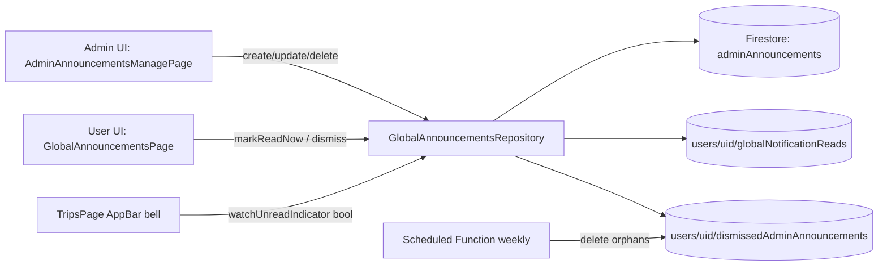

## Annonces administrateur globales — Plan d'action

### Contexte fonctionnel

Permettre aux super-administrateurs de l'application de communiquer avec l'ensemble des utilisateurs via des annonces qui ne sont rattachees a aucun voyage en particulier.

Cote administration, les super-administrateurs disposent d'une zone dediee dans l'interface d'administration pour publier ces annonces, les modifier et les supprimer.

Cote utilisateur, une cloche surmontee d'une petite pastille rouge sans compteur apparait a cote du badge de profil sur la page d'accueil (la liste des voyages) des qu'au moins une annonce n'a pas encore ete consultee. Un clic sur cette cloche ouvre une page de lecture dediee, distincte de l'interface d'administration, ou les annonces s'affichent avec leurs liens hypertextes cliquables. La pastille rouge disparait des l'ouverture de cette page.

Lorsque l'admin autorise le masquage pour une annonce, chaque utilisateur peut depuis cette page la masquer individuellement pour ne plus la voir lors de ses prochaines visites, sans que cela n'affecte les autres utilisateurs ; sinon le controle de masquage n'est pas affiche pour cette annonce.

Les annonces sont publiees simultanement dans plusieurs langues au sein d'un meme message ; chaque utilisateur voit automatiquement la version correspondant a la langue configuree dans son application.

### Lots d'execution

- **Lot A — Fondations data**: modeles de donnees, selecteur de section selon la langue de l'utilisateur (avec tests unitaires), repository, providers Riverpod, regles Firestore.
- **Lot B — Administration**: page de gestion des annonces globales (creation, modification, suppression) accessible depuis l'interface d'administration existante, et route correspondante.
- **Lot C — Point d'entree utilisateur**: cloche avec pastille rouge sur la page des voyages, et route racine vers la page de lecture des annonces.
- **Lot D — Lecture utilisateur**: page de lecture des annonces (rendu localise, liens cliquables, marquage lu a l'ouverture, dismiss individuel) et cles de localisation pour les chaines visibles par l'utilisateur.
- **Lot E — Qualite**: passe `flutter analyze`, tests widget, captures de validation visuelle.
- **Lot F — Nettoyage planifie**: Cloud Function planifiee hebdomadaire qui supprime les docs `dismissedAdminAnnouncements` orphelins (dont l'annonce parente a ete supprimee).

### Priorite a la realite du code (regle prioritaire pendant l'implementation)

Cette regle prime sur toutes les sections techniques qui suivent.

Le plan technique decrit ci-dessous a ete redige a partir d'une lecture statique du repo a un instant donne. Il peut etre incomplet, desuet, ou en decalage avec l'etat reel du code, des dependances, des regles Firestore ou des API Firebase au moment de l'implementation.

**En cas de contradiction entre le plan et la realite du code constatee pendant l'implementation, c'est l'implementation concrete qui prime.** Aucun ecart par rapport au plan ne doit etre fait silencieusement.

Procedure obligatoire pour l'agent en cas de contradiction:

1. **Arreter immediatement** le travail en cours sur le lot concerne. Ne pas tenter de contournement creatif ni d'invention.
2. **Remonter au product owner** un message clair contenant:
   - le **probleme constate** (citation precise du ou des fichiers et symboles concernes);
   - **pourquoi le plan ne peut pas etre suivi tel quel** a cet endroit;
   - une ou plusieurs **propositions de solution** avec leurs trade-offs (impact sur les autres lots, complexite, performance, securite, l10n, etc.).
3. **Attendre la decision** explicite du product owner avant de reprendre l'implementation.

L'objectif est de garantir que le plan reste un guide utile, mais que la decision finale revient toujours au product owner quand la realite diverge.

### Contexte d'execution (override des regles par defaut pour cette implementation)

Cette section **override explicitement** certaines regles par defaut du repo (`CLAUDE.md`, `GUIDELINES.md`, `.cursor/rules/planerz-guidelines.mdc`) pour la duree de cette implementation specifiquement.

- **Branche Git**: `develop` **uniquement**. Ne pas creer de branche feature, ne pas pusher sur d'autres branches.
- **Projet Firebase cible**: `planerz-preview` **uniquement** (alias `preview` dans `.firebaserc`). Ne jamais deployer ni pointer vers un autre projet (et surtout pas sur `planerz` qui est la production).
- **Deploiements autorises sans demander**: l'agent peut deployer **sans demande prealable** les `firestore.rules`, les `firestore indexes` et les Cloud Functions sur `planerz-preview`. Cette autorisation override la regle par defaut "Do not run `firebase deploy` on your own initiative" pour ce projet uniquement. Apres tout deploiement de fonction HTTP/callable, la regle "Cloud Functions IAM check" du repo s'applique normalement (verifier `allUsers` / `roles/run.invoker`); pour les Scheduled Functions (Lot F), pas de verification IAM publique a faire.
- **Commits**: l'agent commit a la fin de chaque lot (un commit par lot, message clair en imperatif anglais conforme aux guidelines, corps du message orientee produit). Cela override la regle par defaut "Do not run `git commit` on your own initiative".
- **Validation entre lots**: apres avoir termine et commit un lot, l'agent **doit attendre un "go" explicite** du product owner avant d'enchainer sur le lot suivant. Aucun lot ne s'enchaine automatiquement.

### 1. Decisions verrouillees

- **Droit de publication**: utiliser le flag deja existant `isApplicationOwner` (champ booleen sur `users/{uid}` lu dans [`lib/features/account/presentation/account_menu_button.dart`](../../lib/features/account/presentation/account_menu_button.dart) ligne 110). Pas de nouveau role.
- **Pastille rouge**: simple point rouge **sans compteur**. Disparait des l'ouverture de la page utilisateur (marquage `lastReadAt` au moment de l'ouverture, comme deja fait pour les annonces de voyage dans [`lib/features/trips/presentation/trip_announcements_page.dart`](../../lib/features/trips/presentation/trip_announcements_page.dart)).
- **Dismiss**: lorsque `userDismissAllowed` est vrai pour l'annonce, bouton de dismiss par annonce cote utilisateur ; sinon pas de controle de masquage. L'annonce dismiss disparait de la liste pour cet utilisateur a la prochaine visite. Le dismiss n'est pas requis pour faire disparaitre la pastille (independant du `lastReadAt`).
- **Suppression admin**: hard delete du document `adminAnnouncements/{id}`. Les docs `dismissedAdminAnnouncements/{id}` chez les utilisateurs deviennent orphelins; ils sont nettoyes en arriere-plan par une Cloud Function planifiee hebdomadaire (mercredi 03:00 Europe/Paris). Voir Lot F et la section dediee.
- **Multilingue**: champ texte brut unique avec sections `[locale]` sur leur propre ligne, ex:

```text
[fr-FR]
Bonjour a tous, ...

[en-US]
Hello everyone, ...
```

- Parseur insensible a la casse, accepte separateurs `-` et `_` (donc `[fr-FR]`, `[fr_FR]`, `[FR-fr]` valides).
- Resolution: locale exacte `xx-YY` -> base langue `xx` -> **premiere section disponible dans l'ordre du texte**.
- Si aucune section detectee (pas d'en-tete dans le texte): afficher le texte brut tel quel.
- Locales actuelles supportees par l'app (cf. [`lib/l10n/app_localizations.dart`](../../lib/l10n/app_localizations.dart) lignes 96-100): `en`, `en_US`, `fr`, `fr_FR`.

### 2. Modele de donnees Firestore

- **`adminAnnouncements/{announcementId}`** (collection globale, racine):
  - `text: string` (le texte brut multilingue saisi par l'admin)
  - `authorId: string`
  - `createdAt: serverTimestamp`
  - `updatedAt: serverTimestamp` (optionnel, pose lors d'un edit)
  - `userDismissAllowed: bool` (optionnel cote donnees historiques; defaut logique **`true`**) — lorsque `false`, les utilisateurs ne voient pas le controle de masquage individuel sur cette annonce ; l'admin peut repasser a `true` via la meme page de modification.
- **`users/{uid}/globalNotificationReads/adminAnnouncements`** (1 doc par user):
  - `lastReadAt: timestamp`
  - `updatedAt: serverTimestamp`
- **`users/{uid}/dismissedAdminAnnouncements/{announcementId}`** (sous-collection, evite un tableau d'UIDs sur le doc):
  - `dismissedAt: serverTimestamp`

Avantage: la suppression cote admin est un simple `delete` sur `adminAnnouncements/{id}`. Aucune lecture ou ecriture cross-utilisateurs n'est necessaire.

### 3. Regles Firestore (a ajouter dans [`firestore.rules`](../../firestore.rules))

```text
match /adminAnnouncements/{announcementId} {
  allow read: if signedIn();
  allow create, update, delete: if signedIn() && isApplicationOwner();
}

match /users/{userId}/globalNotificationReads/{docId} {
  allow read, write: if signedIn() && request.auth.uid == userId;
}

match /users/{userId}/dismissedAdminAnnouncements/{announcementId} {
  allow read, delete: if signedIn() && request.auth.uid == userId;
  allow create: if signedIn()
    && request.auth.uid == userId
    && adminAnnouncementAllowsUserDismiss(announcementId);
}
```

`isApplicationOwner()` doit etre defini comme: `get(/databases/$(database)/documents/users/$(request.auth.uid)).data.isApplicationOwner == true`.

`adminAnnouncementAllowsUserDismiss(announcementId)` (fonction auxiliaire dans les regles) impose que le document `adminAnnouncements/{announcementId}` existe et que `userDismissAllowed` soit absent ou strictement `true`, aligne avec le defaut client pour les annonces historiques.

### 4. Architecture technique



### 5. Nouveaux fichiers cote Flutter

- **Domain**: `lib/features/administration/domain/admin_announcement.dart`
  - Modele `AdminAnnouncement(id, text, authorId, createdAt, userDismissAllowed, updatedAt?)`
  - `fromDoc` / `toMap`
- **Domain**: `lib/features/administration/domain/admin_announcement_localized_text.dart`
  - Fonction pure `String resolveAdminAnnouncementText(String rawText, Locale locale)` avec parseur de sections `[locale]`, fallback selon regle definie. Testable en isolation.
- **Data**: `lib/features/administration/data/global_announcements_repository.dart`
  - Provider Riverpod `globalAnnouncementsRepositoryProvider`.
  - Methodes:
    - `Stream<List<AdminAnnouncement>> watchAnnouncements()` (ordre `createdAt asc` ou `desc` au choix produit, par defaut desc pour le plus recent en haut).
    - `Stream<List<AdminAnnouncement>> watchVisibleAnnouncementsForCurrentUser()` (filtre les dismiss locaux via combinaison de streams).
    - `Stream<bool> watchHasUnreadIndicator()` (true si au moins 1 doc avec `createdAt > lastReadAt`).
    - `Future<void> sendAnnouncement(String text)`.
    - `Future<void> updateAnnouncement(String id, String text)`.
    - `Future<void> deleteAnnouncement(String id)`.
    - `Future<void> markAsReadNow()`.
    - `Future<void> dismissAnnouncement(String id)`.
  - Providers derives:
    - `globalAnnouncementsListProvider` (StreamProvider).
    - `globalAdminAnnouncementsUnreadIndicatorProvider` (StreamProvider<bool>).
- **Presentation admin**: `lib/features/administration/presentation/admin_announcements_manage_page.dart`
  - Liste + champ d'edition (multiligne, large) + boutons creer/modifier/supprimer.
  - Helper text expliquant le format `[fr-FR]` ... `[en-US]` ... (textes hardcodes en francais, conformement a l'exception admin du repo).
  - Apercu rendu (optionnel mais utile): bascule "FR / EN" pour visualiser le rendu localise avant publication.
- **Presentation user**: `lib/features/administration/presentation/global_announcements_page.dart`
  - `static const String routePath = '/announcements';`
  - Liste lecture seule, chaque carte: texte resolu via `resolveAdminAnnouncementText` + `LinkifiedText` (deja existant: [`lib/core/presentation/linkified_text.dart`](../../lib/core/presentation/linkified_text.dart)) + date + bouton dismiss (icone `Icons.close`).
  - `initState` -> `markAsReadNow()` apres premier frame (idempotent, comme deja fait pour les annonces de voyage).
- **Widget cloche**: `lib/features/administration/presentation/admin_announcements_bell_button.dart`
  - `IconButton` avec `Icons.notifications_outlined`.
  - Stack avec un petit dot rouge quand `globalAdminAnnouncementsUnreadIndicatorProvider == true`.
  - `onPressed` -> `context.push('/announcements')`.

### 6. Fichiers existants modifies (ciblage minimal)

- **[`lib/app/router.dart`](../../lib/app/router.dart)** (ligne ~117 zone admin):
  - Ajouter route `/administration/announcements` -> `AdminAnnouncementsManagePage`.
  - Ajouter route racine `/announcements` -> `GlobalAnnouncementsPage`.
- **[`lib/features/administration/presentation/administration_page.dart`](../../lib/features/administration/presentation/administration_page.dart)**:
  - Ajouter une section "Annonces globales" dans le `ListView` du `_StatsBody` (ou directement avant les expanders) avec une carte cliquable qui pousse vers `AdminAnnouncementsManagePage`.
- **[`lib/features/trips/presentation/trips_page.dart`](../../lib/features/trips/presentation/trips_page.dart)**:
  - Dans la zone `actions` du `AppBar` (ligne 52), inserer `AdminAnnouncementsBellButton()` **avant** `AccountAppBarActions()`.
- **[`lib/l10n/app_fr.arb`](../../lib/l10n/app_fr.arb)**, **[`lib/l10n/app_fr_FR.arb`](../../lib/l10n/app_fr_FR.arb)**, **[`lib/l10n/app_en.arb`](../../lib/l10n/app_en.arb)**, **[`lib/l10n/app_en_US.arb`](../../lib/l10n/app_en_US.arb)**:
  - Ajouter cles l10n pour les chaines utilisateur (page user + tooltip cloche + dismiss + empty state). Exemples de cles: `globalAnnouncementsTitle`, `globalAnnouncementsEmpty`, `globalAnnouncementsBellTooltip`, `globalAnnouncementsDismissTooltip`.
  - Pas de cles l10n pour la page d'admin (regle du repo: l'administration est en francais hardcode).
- **[`firestore.rules`](../../firestore.rules)**:
  - Ajouter helper `isApplicationOwner()` (s'il n'existe pas deja) et les blocs `match` cites en section 3.
- **[`functions/index.js`](../../functions/index.js)**:
  - Ajouter la Scheduled Function `cleanupOrphanAdminAnnouncementDismisses` (Lot F). Voir section 10.

### 7. UX - details cles

- **Page user**:
  - Tri: plus recent en haut.
  - Carte: `LinkifiedText` (clickable links) + date relative ou format compact + icone `close` en haut a droite pour dismiss.
  - Empty state: "Aucune annonce pour le moment" (l10n).
  - Pull-to-refresh non requis (stream temps reel).
- **Page admin**:
  - Liste chronologique (plus recent en haut), chaque ligne avec actions Edit / Supprimer (avec confirmation, pattern identique a [`lib/features/trips/presentation/trip_announcements_page.dart`](../../lib/features/trips/presentation/trip_announcements_page.dart)).
  - Champ de saisie multiligne large (`maxLines: 12`), `maxLength: 8000`.
  - Petit help text rappelant le format des sections `[fr-FR]` / `[en-US]`.
- **Cloche**: meme zone que le badge profil, dot non clignotant, taille discrete.

### 8. Cas limites

- **`createdAt` null transitoire** apres write: le filtre `createdAt > lastReadAt` ignore les docs sans `createdAt`; ils s'afficheront sans declencher la pastille jusqu'a la resolution serverTimestamp (acceptable).
- **Aucune annonce + jamais de read state**: pastille = false (pas de doc => pas de unread).
- **Admin se deconnecte / perd le flag**: les writes futurs echouent au niveau des rules, l'UI cachait deja l'entree de menu.
- **Dismiss puis nouveau message identique**: nouveau doc = nouveau `id` = pas dismiss = visible.
- **Texte sans en-tete `[locale]`**: affiche tel quel (pas de parsing).
- **Plusieurs en-tetes pour la meme locale**: garder la premiere occurrence.
- **Edit qui change le texte**: ne reinitialise pas le `lastReadAt` des autres users (decision produit par defaut: l'edit n'est pas un nouvel evenement).

### 9. Tests

- **Unit (parseur)** sur `resolveAdminAnnouncementText`:
  - Resolution exacte `fr-FR`.
  - Fallback langue de base `fr` quand seul `fr` est present.
  - Fallback "premiere section" quand aucune correspondance.
  - Texte sans en-tete -> retourne tel quel.
  - Insensibilite a la casse + tolerance `_` vs `-`.
- **Repository** (avec `fake_cloud_firestore`):
  - CRUD basique.
  - `watchHasUnreadIndicator` true/false selon `lastReadAt` vs `createdAt`.
  - `dismissAnnouncement` n'affecte pas les autres users.
- **Widget**:
  - Cloche affiche/masque le dot selon le provider.
  - Page user: tap dismiss retire la carte de la liste (combinaison stream).
  - Page user: ouverture declenche `markAsReadNow()` (mockable).
  - `LinkifiedText` rend bien les URLs cliquables (deja teste, juste verification d'integration).

### 10. Nettoyage planifie cote Cloud Functions (Lot F)

- **Fichier**: ajouter dans [`functions/index.js`](../../functions/index.js).
- **Nom**: `cleanupOrphanAdminAnnouncementDismisses`.
- **Type**: `onSchedule` (Firebase Functions v2, module `firebase-functions/v2/scheduler`).
- **Planning**: tous les mercredis a 03:00, fuseau `Europe/Paris`. Cron: `'0 3 * * 3'`.
- **Region**: `europe-west9` (regle du repo).
- **Logique**:
  1. Lister les IDs des annonces vivantes via `db.collection('adminAnnouncements').listDocuments()` -> ensemble d'IDs.
  2. Scanner toutes les dismiss en une seule requete via `db.collectionGroup('dismissedAdminAnnouncements').get()`.
  3. Pour chaque doc trouve dont l'ID n'est pas dans l'ensemble des annonces vivantes: `delete` (par batch de 500).
- **Idempotence**: re-execution sans effet de bord si plus aucun orphelin (rien a supprimer).
- **Pas de check IAM `allUsers`** (les Scheduled Functions sont declenchees par Cloud Scheduler via service account interne, pas publiquement). La regle "Cloud Functions IAM check" du repo ne s'applique pas ici.
- **Cout**: 0 USD tant que le projet a moins de 3 jobs Cloud Scheduler total (free tier). Tarif au-dela: 0,10 USD/mois par job, fixe et independant de la frequence.
- **Deploiement**: a executer par le product owner via `firebase deploy --only functions:cleanupOrphanAdminAnnouncementDismisses --project <projet>`. L'agent ne deploie jamais de lui-meme.
- **Tests**: test unitaire de la fonction de calcul des orphelins (logique deterministique sur deux ensembles d'IDs), separe du test d'integration Firebase qui necessite l'emulateur.

### 11. Hors scope (a valider explicitement avant ajout futur)

- Pas de notification push FCM pour les annonces globales dans cette V1 (peut etre ajoute plus tard avec une fonction `notifyAdminAnnouncementRecipients` analogue a `notifyTripAnnouncementRecipients` dans [`functions/index.js`](../../functions/index.js) ligne 1689).
- Pas de canal Android dedie.
- Pas de pieces jointes ni d'images.
- Pas de programmation differee (publication immediate).
- Pas de ciblage par segment d'utilisateurs.
