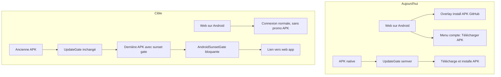
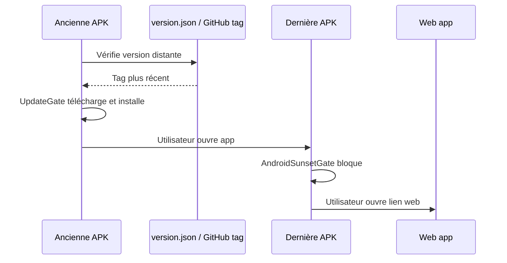

# Décommission Android : retrait APK web + gate sunset native

## Contexte de la demande

Pendant la phase de développement, l'app Android native est décommissionnée au profit de la **web app**, dont la maintenance et le déploiement sont nettement moins contraignants. Concrètement :

- **Côté web** : supprimer toute référence et incitation au téléchargement de l'APK depuis GitHub (page de connexion, menu compte, code et traductions associés).
- **Côté Android natif** : après une **dernière** mise à jour APK, bloquer l'application par une gate indiquant que l'app Android n'est plus utilisable et orienter les utilisateurs vers la web app (avec lien direct).
- **Transition** : les anciennes APK encore installées continuent d'utiliser `UpdateGate` pour recevoir cette dernière version ; une fois installée, la gate sunset prend le relais.

Le lien « Notes de version » GitHub dans Aide & support est **conservé** — il concerne les releases de la web app, pas le téléchargement APK.

## Contexte technique actuel

Deux surfaces web poussent le téléchargement APK GitHub :

| Emplacement | Mécanisme |
|---|---|
| [`sign_in_page.dart`](../../lib/features/auth/sign_in_page.dart) | Overlay `_buildAndroidPwaInstallGate` si `isAndroidPwaMode()` (user-agent Android sur web) |
| [`account_menu_button.dart`](../../lib/features/account/presentation/account_menu_button.dart) | Entrée menu « Télécharger l'APK » si `isAndroidPwaMode()` |

Les deux appellent `launchUrl(appPreviewApkDownloadUri)` défini dans [`external_links.dart`](../../lib/core/external_links.dart).

Sur Android natif, [`UpdateGate`](../../lib/app/update/update_gate.dart) (dans [`app.dart`](../../lib/app/app.dart)) gère déjà une gate de mise à jour obligatoire avec téléchargement/installation APK — mécanisme à conserver pour les **anciennes** APK encore en circulation jusqu'à la dernière release.



## Partie 1 — Web : retirer toute incitation APK

### [`sign_in_page.dart`](../../lib/features/auth/sign_in_page.dart)

Supprimer en bloc :
- État `_showAndroidPwaInstallOverlay`, `_androidPwaInstallOverlayDismissedForSession`
- Initialisation `isAndroidPwaMode()` dans `initState`
- `_openAndroidApkDownload`, `_dismissAndroidPwaInstallOverlay`, `_buildAndroidPwaInstallGate`
- Branche conditionnelle `if (_showAndroidPwaInstallOverlay)` — les boutons Google / téléphone s'affichent toujours
- Imports : `external_links`, `android_pwa_mode_detector`, `font_awesome_flutter` (si plus utilisé ailleurs dans le fichier), `url_launcher` (si plus utilisé)

### [`account_menu_button.dart`](../../lib/features/account/presentation/account_menu_button.dart)

Supprimer :
- `_downloadApk` et le handler `download_apk`
- Paramètre `showDownloadApkAction` et le `PopupMenuItem` conditionnel
- Imports : `external_links`, `android_pwa_mode_detector`, `url_launcher` (si plus utilisé)

### Fichiers devenus orphelins

- Supprimer [`external_links.dart`](../../lib/core/external_links.dart) (seul consommateur des deux écrans ci-dessus)
- Supprimer le trio [`android_pwa_mode_detector.dart`](../../lib/core/platform/android_pwa_mode_detector.dart) + `_stub` + `_web` (plus aucun usage après nettoyage)

### Localisation — clés à retirer des 4 ARB de référence

[`app_fr.arb`](../../lib/l10n/app_fr.arb), [`app_fr_FR.arb`](../../lib/l10n/app_fr_FR.arb), [`app_en.arb`](../../lib/l10n/app_en.arb), [`app_en_US.arb`](../../lib/l10n/app_en_US.arb) :

- `signInAndroidPwaInstallOverlayMessage`
- `accountDownloadApk`

Puis `flutter gen-l10n` (ou laisser l'analyse régénérer).

**Conservé** (confirmé) : lien « Notes de version » GitHub dans [`help_support_page.dart`](../../lib/features/help_support/presentation/help_support_page.dart) — concerne les releases web, pas le téléchargement APK.

---

## Partie 2 — Android natif : gate sunset bloquante

### Nouveau widget `AndroidSunsetGate`

Créer [`lib/app/android_sunset_gate.dart`](../../lib/app/android_sunset_gate.dart) :

- **Condition** : `!kIsWeb && Platform.isAndroid` → afficher écran bloquant ; sinon → `child`
- **`PopScope(canPop: false)`** comme `UpdateGate` pour empêcher la navigation arrière
- **Contenu** (pattern proche de `_UpdateAutomaticWarningBanner` dans `update_gate.dart`) :
  - Icône + titre + corps explicatif (Android n'est plus maintenu, utiliser la web app)
  - Lien cliquable vers `publicAppBaseUriForTarget(ref.watch(firebaseTargetProvider))` ([`app_public_hosts.dart`](../../lib/core/firebase/app_public_hosts.dart))
  - Bouton principal « Ouvrir la version web » (`launchUrl` en `LaunchMode.externalApplication`)
- **Pas** de bouton téléchargement APK, pas de retry installateur

### Nouvelles clés l10n (4 ARB)

Proposition de libellés :

| Clé | FR (exemple) |
|---|---|
| `androidSunsetTitle` | Application Android non disponible |
| `androidSunsetBody` | L'application Android n'est plus maintenue pendant le développement. Utilise Planerz depuis le navigateur pour continuer. |
| `androidSunsetOpenWebButton` | Ouvrir la version web |

### Branchement dans [`app.dart`](../../lib/app/app.dart)

Envelopper l'arbre existant :

```dart
AndroidSunsetGate(
  child: UpdateGate(
    child: ColoredBox(...),
  ),
)
```

**Ordre intentionnel** : sur la dernière APK, `AndroidSunsetGate` bloque immédiatement — `UpdateGate` ne s'exécute plus. Sur les **anciennes** APK (sans sunset gate), `UpdateGate` continue de pousser la mise à jour vers cette dernière APK.

---

## Partie 3 — Ce qu'on ne touche pas (hors scope)

- Infrastructure `UpdateGate` / `android_apk_update_installer` / fetchers GitHub & Storage — nécessaire pour la transition des anciennes APK
- [`help_support_page.dart`](../../lib/features/help_support/presentation/help_support_page.dart) — lien release notes GitHub conservé
- [`about_page.dart`](../../lib/features/about/presentation/about_page.dart) — lien profil GitHub org (pas APK)
- Règles Storage `versions/planerz.preview.apk` — peuvent rester en place pour l'instant ; nettoyage infra APK possible dans un second temps après déploiement

---

## Partie 4 — Tests et validation

### Test unitaire/widget

Ajouter `test/app/android_sunset_gate_test.dart` :
- Mock `isAndroidCheck` (même pattern injectable que `UpdateGate`)
- Vérifie que sur « Android » le titre sunset s'affiche et que `child` est masqué
- Vérifie que hors Android / web, `child` passe

### Vérifications manuelles

| Plateforme | Attendu |
|---|---|
| Web desktop | Connexion normale, menu compte sans APK |
| Web sur Android (Chrome mobile) | Idem — plus d'overlay GitHub |
| APK actuelle (avant release) | Comportement UpdateGate inchangé |
| Dernière APK (avec ce code) | Écran sunset immédiat, lien web preview ou prod selon flavor |

### CI locale

`flutter analyze` après modifications.

---

## Partie 5 — Déploiement (actions product owner)

1. **Web** : déployer dès merge — les utilisateurs web ne voient plus la promo APK
2. **Dernière APK Android** : `flutter build apk` (preview et/ou prod selon [`RELEASE.md`](../../RELEASE.md)), publier sur GitHub / Storage, **incrémenter** `versions/version.json` (preview) ou tag GitHub (prod) pour que les anciennes APK reçoivent la mise à jour
3. **IAM Cloud Run** : pas concerné (pas de nouvelle Cloud Function)
4. Communiquer aux testeurs Android : désinstaller l'APK après bascule si besoin


