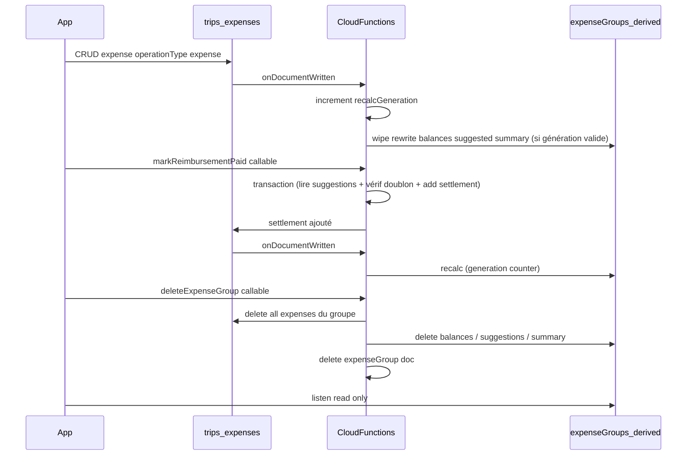

# Plan — Équilibres et remboursements côté Cloud Functions

> **Statut :** plan (non implémenté). Décisions validées en session de conception (grill-me) + revue critique.
> Migration des données `expenseSettledTransfers` hors scope.

## Objectif

- Calcul **100 % serveur** des soldes, remboursements suggérés et totaux d'en-tête par poste.
- Remboursements matérialisés comme opérations dans `trips/{tripId}/expenses` (`operationType: settlement`).
- **Aucun** calcul côté client (y compris « Ma dépense » / « Total du poste »).
- Références participant uniquement via **participantId** (document `TripMember`), jamais UID dans les champs métier settlement.

---

## Décisions validées (récap)

| Sujet | Choix |
|--------|--------|
| Remboursement payé | Ligne dans `trips/{tripId}/expenses` avec `operationType: settlement` |
| Calcul client | Aucun (y compris totaux en-tête poste) |
| Migration données | Hors scope |
| Références | `participantId` pour payeur / participants ; pas d'UID dans les champs métier settlement |
| Dérivés | Sous chaque `expenseGroups/{groupId}/` : `balances/`, `suggestedReimbursements/`, doc `summary/current` |
| Totaux en-tête | **Poste uniquement** (`operationType: expense` + `groupId`) — totaux cross-postes supprimés |
| Champ type | Nouveau `operationType` : `expense` \| `settlement` (ne pas réutiliser `category`) |
| Marquer / démarquer | Callables ; id Firestore **auto** + anti-doublon via **transaction Firestore** |
| Concurrence recalc | **Generation counter** sur `expenseGroups/{groupId}` — le trigger abandonne si dépassé |
| Permission mark/unmark | Membre voyage **et** poste visible (`visibleToMemberIds`) |
| Lecture dérivés | `isTripMember` ; filtre visibilité **app** (inchangé) |
| Remboursement manuel | V1 : uniquement depuis une suggestion |
| Trigger recalc | `onDocumentWritten` sur `expenses/{expenseId}` → recalc du `groupId` concerné |
| Suppression poste | **Callable CF** `deleteExpenseGroup` (Admin SDK, multi-batches de 499 ops) |
| `expenseSettledTransfers` | Retirer règles + code app ; docs prod ignorés |
| UI opérations | Settlements visibles avec **style distinct** ; totaux excluent `settlement` |
| UI suggestions | Données **complètes** pour le poste ; filtre « moi » par défaut + toggle « tout le poste » |
| Logique JS partagée | Copier dans `functions/expense_settlement.js` + documenter synchro avec `scripts/` |
| Nommage JS | Tout en `participantId` (`fromParticipantId` / `toParticipantId`) — notion "user" bannie des champs métier |



---

## 1. Modèle Firestore

### `expenses` (existant, enrichi)

- `operationType`: `"expense"` (défaut si absent en lecture) \| `"settlement"`.
- Settlement (callable) : `groupId`, `currency`, `paidBy` = **débiteur** (`fromParticipantId`), `participantIds: [toParticipantId]`, `amount`, `splitMode: equal`, `title` / `expenseDate` (timestamp serveur ou jour courant — implémentation au plus simple).
- `createdBy` : conserver **UID** auth pour audit (comme aujourd'hui) ; seuls payeur / participants restent en `participantId`.
- Ne plus écrire `category` sur les **nouvelles** lignes (lecture legacy tolérée).

### `expenseGroups/{groupId}` (enrichi)

- `recalcGeneration`: `number` — incrémenté via `FieldValue.increment(1)` à chaque démarrage de recalc. Permet au trigger d'abandonner si une invocation plus récente a pris le relais.

### Sous `expenseGroups/{groupId}/`

| Chemin | Contenu | Écriture |
|--------|---------|----------|
| `balances/{currency}` | `{ currency, nets: { [participantId]: number } }` — soldes **après** toutes les ops (expense + settlement), arrondis `roundMoney`. Tout solde dont \(|net| < 0,5\) est **considéré comme 0** (équilibré) **et reste remonté** dans `nets` | CF seule |
| `suggestedReimbursements/{autoId}` | `{ fromParticipantId, toParticipantId, amount, currency }` | CF seule ; **delete collection** puis recréation à chaque recalc |
| `summary/current` | voir schéma ci-dessous | CF seule |

### Schéma de `summary/current`

```json
{
  "settlementComputedAt": "<Timestamp>",
  "postTotalsByCurrency": {
    "EUR": 0.0,
    "USD": 0.0
  },
  "paidByTotalsByCurrency": {
    "<participantId>": {
      "EUR": 0.0,
      "USD": 0.0
    }
  }
}
```

- `postTotalsByCurrency` : somme des `amount` de toutes les expenses `operationType: expense` du groupe, par devise.
- `paidByTotalsByCurrency` : pour chaque `paidBy`, somme des montants payés (`operationType: expense` uniquement) par devise. Permet à l'UI d'afficher « Ma dépense » sans calcul local.

Algorithme : `functions/expense_settlement.js` (copie de `scripts/expense_settlement.js`, champs renommés en `participantId`) — **`computeBalances` + `suggestTransfers` uniquement** (plus de `applySettledTransfers` dans le pipeline CF : les settlements sont déjà dans `expenses`).

Règles produit (groupes de participants) :

- Les ids manipulés dans les dépenses/soldes/suggestions/settlements sont des **unités de facturation** : `TripMember` non groupé **ou** `ParticipantGroup`.
- Un `TripMember` appartenant à un `ParticipantGroup` ne doit **jamais** apparaître individuellement dans les écritures dérivées (balances/suggestions) : seul l’id du groupe est pris en compte.

---

## 2. Cloud Functions (`functions/index.js`)

Module dédié : `functions/expense_settlement_recalc.js`, qui `require('./expense_settlement.js')` (copie locale — voir note synchro section 6).

### Trigger `recomputeExpenseGroupSettlement`

- `onDocumentWritten({ document: 'trips/{tripId}/expenses/{expenseId}' })`.
- Lire `groupId` (before/after) ; recalculer **chaque** groupe touché (si `groupId` change : ancien + nouveau).

**Protocole generation counter (par groupe) :**

1. Incrémenter `recalcGeneration` sur le doc `expenseGroups/{groupId}` via `FieldValue.increment(1)`, puis relire la valeur obtenue (`myGeneration`).
2. Charger toutes les `expenses` du trip avec ce `groupId` (settlements inclus).
3. Calculer `balances`, `suggestedReimbursements`, `summary/current`.
4. Dans une **transaction finale** : lire `recalcGeneration` du groupe.
   - Si la valeur vaut toujours `myGeneration` → écrire les dérivés (étapes ci-dessous) dans la transaction.
   - Sinon → **abandonner** silencieusement (une invocation plus récente écrira le résultat final).

Contenu de l'écriture dans la transaction finale :
1. Supprimer tous les docs `suggestedReimbursements/*` du groupe.
2. Écrire `balances/{currency}` (une par devise), en conservant les lignes à l’équilibre (0).
3. Créer les `suggestedReimbursements/*`.
4. Mettre à jour `summary/current`.

### Callable `markExpenseReimbursementPaid`

- Auth requise ; résoudre `participantId` du caller via `participants` (`userId` → doc id).
- Lire `expenseGroups/{groupId}` pour vérifier membre voyage + `visibleToMemberIds`.
- **Transaction Firestore :**
  1. Lire le snapshot de `suggestedReimbursements/*` du groupe.
  2. Valider que `(fromParticipantId, toParticipantId, amount, currency, groupId)` correspond à une suggestion courante (matcher `BALANCE_EPSILON`).
  3. Lire les expenses `operationType: settlement` du groupe — vérifier absence de doublon (même paire + montant + devise, tolérance epsilon).
  4. `add()` le settlement dans la même transaction ; retourner `expenseId`.

### Callable `unmarkExpenseReimbursementPaid`

- Même contrôles d'accès (membre voyage + `visibleToMemberIds`).
- Supprimer la ligne `settlement` identifiée par `expenseId` en vérifiant `operationType === 'settlement'` + `groupId`.

### Callable `deleteExpenseGroup`

- Auth requise ; vérifier membre voyage + permission `deleteExpensePostMinRole`.
- Lire le doc `expenseGroups/{groupId}` : vérifier existence et visibilité (`visibleToMemberIds`).
- Via Admin SDK, supprimer en séquence (multi-batches de 499 ops max) :
  1. Toutes les `expenses` du trip avec ce `groupId`.
  2. Tous les docs `balances/`, `suggestedReimbursements/`, `summary/` sous le groupe.
  3. Le doc `expenseGroups/{groupId}` lui-même.

Région : `europe-west9` (déjà `setGlobalOptions`).

**Déploiement (PO)** : `firebase deploy --only functions:recomputeExpenseGroupSettlement,functions:markExpenseReimbursementPaid,functions:unmarkExpenseReimbursementPaid,functions:deleteExpenseGroup --project <id>` + vérif IAM Cloud Run `allUsers` / `roles/run.invoker` sur les callables.

---

## 3. Règles Firestore (`firestore.rules`)

### Sous-collections dérivées

```
match /trips/{tripId}/expenseGroups/{groupId}/balances/{id} {
  allow read: if isTripMember(tripId);
  allow write: if false;
}
match /trips/{tripId}/expenseGroups/{groupId}/suggestedReimbursements/{id} {
  allow read: if isTripMember(tripId);
  allow write: if false;
}
match /trips/{tripId}/expenseGroups/{groupId}/summary/{id} {
  allow read: if isTripMember(tripId);
  allow write: if false;
}
```

### Expenses — blocage settlement côté client (3 cas explicites)

**Create** — interdire la création d'un doc avec `operationType: settlement` :
```
allow create: if <contrôles membre/rôle existants>
  && request.resource.data.get('operationType', 'expense') != 'settlement';
```

**Update** — interdire de modifier un settlement existant ET d'en créer un par update :
```
allow update: if <contrôles membre/rôle existants>
  && resource.data.get('operationType', 'expense') != 'settlement'
  && request.resource.data.get('operationType', 'expense') != 'settlement';
```

**Delete** — interdire la suppression directe d'un settlement (uniquement via callable CF) :
```
allow delete: if <contrôles membre/rôle existants>
  && resource.data.get('operationType', 'expense') != 'settlement';
```

### Nettoyage

- **Supprimer** le bloc `expenseSettledTransfers`.

---

## 4. Flutter — data

### `lib/features/expenses/data/expense.dart`

- Enum `ExpenseOperationType { expense, settlement }`.
- `fromDoc` / `toCreateMap` : `operationType` ; défaut `expense` si absent.

### `lib/features/expenses/data/expenses_repository.dart`

- Streams (pas de calcul) :
  - `watchGroupBalances(tripId, groupId)`
  - `watchGroupSuggestedReimbursements(tripId, groupId)`
  - `watchGroupExpenseSummary(tripId, groupId)` → `summary/current`
- Callables via `FirebaseFunctions.instanceFor(region: 'europe-west9')` : `markExpenseReimbursementPaid`, `unmarkExpenseReimbursementPaid`, `deleteExpenseGroup`.
- `deleteExpenseGroup` : appel de la callable CF (plus de batch client).

### Modèles sous `lib/features/expenses/data/`

- `GroupBalance { currency, nets: Map<String, double> }`
- `SuggestedReimbursement { fromParticipantId, toParticipantId, amount, currency }`
- `ExpenseGroupSummary` :

```dart
class ExpenseGroupSummary {
  final DateTime? settlementComputedAt;
  /// Somme des expenses du poste par devise (operationType: expense uniquement).
  final Map<String, double> postTotalsByCurrency;
  /// Total payé (paidBy) par participant et par devise (expenses uniquement).
  final Map<String, Map<String, double>> paidByTotalsByCurrency;
}
```

---

## 5. Flutter — UI `lib/features/expenses/presentation/trip_expenses_page.dart`

- **En-tête totaux** : alimenté par `summary/current` via stream.
  - « Total du poste » ← `postTotalsByCurrency`.
  - « Ma dépense » ← `paidByTotalsByCurrency[currentUserMemberId]`.
  - **Supprimer** `_sumByCurrency`, `allTripExpenses` pour les totaux et toute référence aux totaux cross-postes.
- Onglet **Opérations** : `expense` + `settlement` avec style distinct.
- Onglet **Équilibres** :
  - **Soldes** : stream `balances/` (inchangé, visibles pour tous les participants du poste).
  - **Remboursements suggérés** : stream `suggestedReimbursements/` — filtre par défaut « moi » (`fromParticipantId` ou `toParticipantId` == `currentUserMemberId`) + toggle pour afficher **toutes** les suggestions du poste.
  - **Marquer / démarquer payé** : callable sur toute suggestion affichée (y compris entre autres participants en mode « tout le poste »).
  - **Réglés** : expenses `operationType: settlement` du groupe ; même filtre/toggle que les suggestions.
- Permissions : **cacher** mark/unmark si non visible / non membre.
- l10n : type settlement, mark/unmark, erreurs callable, libellé toggle.

---

## 6. Nettoyage

- Retirer références app à `expenseSettledTransfers` / `settled_transfer.dart` / domain settlement local.
- `scripts/trip_expense_settlements.js` : note « prod = expenses settlement » — hors scope fonctionnel.
- `scripts/expense_settlement.js` : ajouter en en-tête que la version authoritative pour la CF est `functions/expense_settlement.js` (nommage `participantId`) ; ce fichier reste pour les scripts utilitaires uniquement. Toute modification de la logique doit être reportée dans les deux fichiers.

---

## 7. Tests

- Test Node unitaire recalc (dépenses + settlement → suggestions attendues, champs `participantId`).
- Pas de test migration.
- `flutter analyze` en fin de chantier.

---

## 8. Ordre d'implémentation

1. Copier + adapter `expense_settlement.js` dans `functions/` (renommage `participantId`)
2. Modèle + règles Firestore (3 cas settlement explicites, dérivés read-only, retirer `expenseSettledTransfers`)
3. Trigger + module JS recalc (avec generation counter)
4. Callables `markExpenseReimbursementPaid` / `unmarkExpenseReimbursementPaid` (transaction anti-doublon)
5. Callable `deleteExpenseGroup` (Admin SDK multi-batches)
6. Repository + modèles Dart + providers
7. UI Équilibres + en-tête totaux + opérations distinctes
8. Tests + `flutter analyze`

---

## Tâches

- [ ] Copier `scripts/expense_settlement.js` → `functions/expense_settlement.js`, renommer tous les champs en `participantId` (`fromParticipantId` / `toParticipantId`)
- [ ] `operationType` sur Expense + règles Firestore (3 cas explicites create/update/delete, dérivés read-only, retirer `expenseSettledTransfers`)
- [ ] Module functions + trigger `onDocumentWritten` avec generation counter → `balances/`, `suggestedReimbursements/`, `summary/current`
- [ ] Callable `markExpenseReimbursementPaid` (transaction Firestore : vérif suggestion + anti-doublon + add)
- [ ] Callable `unmarkExpenseReimbursementPaid`
- [ ] Callable `deleteExpenseGroup` (Admin SDK multi-batches)
- [ ] `ExpensesRepository` : streams dérivés, callables, `deleteExpenseGroup` → CF
- [ ] `trip_expenses_page` : zéro calcul local, en-tête via `summary/current`, onglets Équilibres/Opérations, filtre suggestions « moi » + toggle, l10n, permissions UI
- [ ] Test Node recalc + `flutter analyze`
