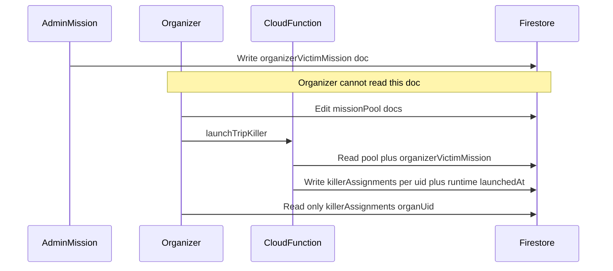

# Plan — Écran Jeux, contributions et Killer

Plan de livraison pour le hub **Jeux** (tuile aperçu + route), l’onglet **jeux apportés**, et le mini-jeu **Killer** piloté depuis les paramètres généraux du voyage (créateur + co-admins), avec tirage serveur, missions cloisonnées par utilisateur, génération optionnelle via Cloud Function + Gemini/Vertex, et règles explicites pour la mission ciblant l’organisateur sans révéler l’assassin.

## Phases successives (par périmètre fonctionnel)

Ordre recommandé **A → E**. À l’intérieur d’une phase, découpage en PR techniques possible ; l’objectif est une **capacité utilisateur** identifiable à la fin de chaque phase. Déployer les rules avant les écritures client correspondantes ; déployer les callables avant les boutons qui les invoquent.

| Phase | Périmètre fonctionnel | Contenu regroupé (détail technique) | Dépend de | Critère « fini » |
|-------|----------------------|--------------------------------------|-----------|------------------|
| **A — Jeux apportés** | Liste des jeux ramenés par les participants | Rules `boardGameContributions` ; modèle + repository + providers ; `GoRoute` `…/games` ; `TripGamesPage` avec onglet contributions ; tuile aperçu branchée + **compteur jeux** ; CRUD + l10n ARB | — | Parcours tuile → contributions sans killer |
| **B — Killer : réglages & sécurité** | Activer le killer sur le voyage et verrouiller les données | Champs killer sur `trips/{tripId}` + `Trip` / `updateTripGeneralSettings` + garde admin ; **rules** whitelist update (`rank ≥ 2`) + **toutes** sous-collections killer (`killerRuntime`, `killerAssignments`, `killerMissionPool`, `killerOrganizerVictimMission`) ; **TripSettingsGeneralPage** : toggle, organisateur, admin mission, exclusions | — | Config persistée + rules déployées ; aucune fuite pool / mission secret |
| **C — Killer : préparation dans Jeux** | Préparer les missions **avant** le tirage | Onglet « Killer » si `killerGameEnabled` ; streams `killerRuntime` / `killerAssignments/{moi}` (états « en attente ») ; **pool** missions organisateur (CRUD manuel) ; **mission admin** sur doc secret ; pas encore les callables de lancement | B | Prêt à lancer côté données + UI ; joueurs voient « attente » si pas lancé |
| **D — Killer : partie en cours** | Lancer, révéler hors-app, retoucher texte, IA optionnelle | CF `launchTripKiller` (`europe-west9`) ; `discloseKillerAssignmentForParticipant` ; `updateKillerMissionForParticipant` ; UI organisateur (lancer, disclose, retouche) ; **`generateTripKillerMissions`** + bouton + secrets Gemini si souhaité dans la même phase ou sous-livraison ; IAM invoker | B, C | Tirage réel + disclose + retouche texte ; IA = bonus dans la même phase |
| **E — Finitions** | Cohérence aperçu voyage & qualité | Tuile aperçu : récap killer post-lancement (victime / début mission) pour l’utilisateur courant ; sweep l10n killer ; `flutter analyze` ; tests (permutation / refus disclose & retouche) | A, C, D | Démo bout-en-bout ; analyse propre |

### Suivi (checklist)

- [ ] **Phase A** — Jeux apportés : rules + repo + route `/games` + tuile + CRUD + l10n (+ badge nombre de jeux sur tuile)
- [ ] **Phase B** — Killer réglages & données : champs Trip + `updateTripGeneralSettings` + rules + bloc killer paramètres généraux
- [ ] **Phase C** — Killer préparation : onglet Killer + streams attente + pool organisateur + saisie mission admin (secret)
- [ ] **Phase D** — Killer vivant : CF launch + disclose + retouche mission + CF génération IA optionnelle + IAM
- [ ] **Phase E** — Finitions : tuile récap killer post-lancement + l10n + analyze + tests clés

### Décisions produit déjà tranchées

- **Placeholders** : les membres placeholder **participent** au killer s’ils sont dans `memberIds` et non exclus ; s’ils ne se connectent pas à l’app, l’**organisateur** peut **révéler** leur mission (cible + texte) **à la demande** via callable — **sauf** pour la personne dont la victime assignée est l’organisateur (impossible de révéler « qui te vise »).
- **Après démarrage** : l’organisateur peut **modifier le texte de mission** d’un participant pour gérer les demandes de changement ; la cible assignée ne change pas. Même interdiction sur le participant qui vise l’organisateur.

### Notes

- **Phase B** : une seule PR « killer Firestore + réglages » limite les déploiements rules à moitié.
- **Phase D** : le chemin **manuel** (sans IA) doit être jouable avant d’activer Gemini ; l’IA peut arriver en **sous-incrément** dans la même phase.
- **Phase E** peut commencer en parallèle mineur (l10n) mais le récap tuile killer dépend du **lancement** (phase D).

## Contexte code existant

- Tuile **Jeux** présente sur l’aperçu mais inactive (`onTap: () {}`, badge à `0`) dans [`trip_overview_page.dart`](../../lib/features/trips/presentation/trip_overview_page.dart).
- **Paramètres généraux** du voyage : [`trip_settings_general_page.dart`](../../lib/features/trips/presentation/trip_settings_general_page.dart) — sauvegarde via [`TripsRepository.updateTripGeneralSettings`](../../lib/features/trips/data/trips_repository.dart) avec [`Trip.memberHasAdminRole`](../../lib/features/trips/data/trip.dart).
- Contrôle d’accès réglages : rôle **≥ admin** via [`resolveTripPermissionRole`](../../lib/features/trips/data/trip_permission_helpers.dart).
- Patron **TabBar / TabBarView** : style de [`trip_activities_page.dart`](../../lib/features/activities/presentation/trip_activities_page.dart) (`DefaultTabController`).
- Routage : `GoRoute` sous `/trips/:tripId/` dans [`router.dart`](../../lib/app/router.dart).
- **Sécurité Firestore** : sous `match /trips/{tripId}` dans [`firestore.rules`](../../firestore.rules), motifs existants (`isTripMember`, `tripCallerRoleRank`). Attention : mise à jour du doc voyage par le **seul owner** — tout champ « serveur-only » doit éviter ce document ou faire évoluer la règle (état lancé peut vivre hors doc voyage, cf. `killerRuntime`).

## Modèle de données (Firestore)

### 1) Configuration killer (éditable créateur + co-admins, avant lancement)

Sur **`trips/{tripId}`** (ou map dédiée `killerSettings`) :

- `killerGameEnabled` (bool)
- `killerOrganizerMemberId` (string, obligatoire si enabled)
- `killerMissionAdminMemberId` (string, obligatoire si enabled)
- `killerExcludedMemberIds` (liste de strings, défaut vide = tous les membres non exclus)

Règle client `update` : `tripCallerRoleRank(tripId) >= 2` **et** `affectedKeys()` limitée à ces clés. Validation métier côté [`functions/index.js`](../../functions/index.js) en complément sur les callables si besoin.

### 2) État « officiellement lancé » (client read-only)

**`trips/{tripId}/killerRuntime/state`** (doc fixe, ex. id `current`) :

- `launchedAt` (timestamp), éventuellement `participantCount`, `version`

`allow read: if isTripMember(tripId)` ; **`allow write: if false`** — uniquement Admin SDK dans les Cloud Functions.

### 3) Pool de missions avant lancement

**`trips/{tripId}/killerMissionPool/{missionId}`** : `text`, `createdAt`, `source` (`manual` \| `ai`), éventuellement `createdBy`.

- Lecture / écriture : **organisateur désigné** (via `killerOrganizerMemberId` du trip).
- Les **autres membres** ne **lisent pas** ce pool avant le tirage.

### 4) Mission secrète « victime = organisateur »

**`trips/{tripId}/killerOrganizerVictimMission/default`** :

- `missionText` (string), `updatedAt`

`allow read, write: if isTripMember(tripId) && request.auth.uid == tripDoc(tripId).data.killerMissionAdminMemberId`

L’**organisateur** ne doit **pas** lire ce doc.

### 5) Assignations après lancement

**`trips/{tripId}/killerAssignments/{participantUid}`** :

- `victimMemberId`, `missionText`, `assignedAt`

`allow read: if isTripMember(tripId) && request.auth.uid == participantUid` ; **`allow write: if false`** — CF uniquement.

**Disclose** : callable **`discloseKillerAssignmentForParticipant`** — après lancement ; appelant = organisateur ; refus si pour `targetMemberId`, `assignment.victimMemberId == killerOrganizerMemberId`.

**Édition post-lancement** : **`updateKillerMissionForParticipant`** — organisateur ; met à jour **uniquement** `missionText` ; refus si la cible de cette personne est l’organisateur.

### 6) Contributions jeux de société

**`trips/{tripId}/boardGameContributions/{docId}`** :

- `ownerMemberId`, `title`, `note?`, `createdAt`, `updatedAt`

`allow read: if isTripMember(tripId)` ; CRUD cohérent avec `ownerMemberId`.

## Cloud Functions (Gen 2, région `europe-west9`)

Conformément aux guidelines du dépôt : pas de `firebase deploy` automatisé par l’agent ; le product owner déploie rules/functions et vérifie IAM des callables ([`RELEASE.md`](../../RELEASE.md)).

1. **`launchTripKiller`** (`onCall`) — organisateur, préconditions lancement, permutation Fisher–Yates, injection mission organisateur depuis doc secret, écriture assignments + runtime.
2. **`generateTripKillerMissions`** (`onCall`) — organisateur ; Gemini/Vertex ; JSON → docs pool.
3. **`discloseKillerAssignmentForParticipant`** (`onCall`) — voir ci-dessus.
4. **`updateKillerMissionForParticipant`** (`onCall`) — retouche texte uniquement ; gardes disclose alignées.

## Flutter — écrans et comportements

- **`TripGamesPage`** : `DefaultTabController` ; onglet **Jeux apportés** ; onglet **Killer** si `trip.killerGameEnabled`.
- Tuile aperçu → `/trips/:tripId/games` ; libellés : nombre de jeux ; après lancement, récap killer pour l’utilisateur courant si pertinent.
- Contributions : liste stream, FAB, édition/suppression des siennes.
- Killer non-organisateur : attente ou lecture `killerAssignments/{myUid}`.
- Killer organisateur : pool CRUD, lancement, disclose placeholders, retouche mission (callables).
- Paramètres généraux : bloc killer (toggle, pickers membres, exclusions) ; étendre `updateTripGeneralSettings`.
- **Localisation** : chaînes utilisateur dans les quatre ARB (`app_fr`, `app_fr_FR`, `app_en`, `app_en_US`).

## Tests / analyse

- `flutter analyze` après implémentation substantive.
- Tests : permutation (fonction pure ou seed) ; disclose / édition : autorisé vs refus quand `victimMemberId == organizerId`.
- Rules : harness existante ou checklist manuelle.

## Décision « challenger » — mission contre l’organisateur

| Risque | Pourquoi |
|--------|----------|
| Organisateur rédige toutes les missions | Il reconnaîtrait la mission qui le vise avant tirage. |
| Pool lisible par tous | Fuites avant lancement. |

**Structure retenue** : mission spéciale rédigée par **`killerMissionAdminMemberId`** dans un doc **illisible** par l’organisateur ; CF au lancement injecte le texte dans **une seule** assignment ; disclose/retouche **interdits** pour l’uid dont la victime est l’organisateur.

## Livrables fichiers principaux

| Zone | Fichiers |
|------|----------|
| Route + overview | [`router.dart`](../../lib/app/router.dart), [`trip_overview_page.dart`](../../lib/features/trips/presentation/trip_overview_page.dart) |
| Modèle / repo voyage | [`trip.dart`](../../lib/features/trips/data/trip.dart), [`trips_repository.dart`](../../lib/features/trips/data/trips_repository.dart), [`trip_settings_general_page.dart`](../../lib/features/trips/presentation/trip_settings_general_page.dart) |
| Nouvelle UI jeux | nouvelle page + repository/providers sous feature dédiée ou `trips` selon convention |
| Backend | [`functions/index.js`](../../functions/index.js), [`firestore.rules`](../../firestore.rules), indexes si besoin |

Après implémentation : `firebase deploy --only firestore:rules`, `firebase deploy --only functions:…`, vérification IAM callable ([guidelines dépôt](../../CLAUDE.md)).
