# Plan — Garde-fous d'usage IA Planerz

> **Statut :** plan (non implémenté). Brouillon de référence pour la mise en place
> de quotas et de garde-fous sur les appels Firebase AI Logic (génération
> d'ingrédients de recette, et futurs usages IA).

## Objectifs

- Empêcher un user/voyage de cramer la facture par accident ou par usage excessif.
- Protéger le free tier global de grounding Google Search (1500 prompts/jour).
- Garder un système **extensible** : un seul mécanisme générique pour la génération d'ingrédients (actif aujourd'hui) **et** les futurs usages IA (consolidation shopping, génération de menu, etc.).
- Déployer par phases pour limiter le risque et l'effort initial.

## Deux patterns d'appel IA dans la codebase

Les usages IA se répartissent en deux catégories avec des contraintes d'enforcement différentes :

### CF-native (ex. consolidation shopping list)

L'appel IA est entièrement géré par une Cloud Function (clef API serveur, SDK Node.js). Le cycle complet — check quota, appel IA, incrément ou refund — se fait dans la même CF via le gate Node.js.

### CF-assisté (ex. génération de recette/ingrédients)

L'appel IA utilise le SDK Firebase AI Logic côté client (credentials Firebase Auth). La CF ne peut pas proxifier cet appel. L'enforcement se fait via le gate Dart :

1. **Réservation** : avant l'appel IA, le gate appelle la CF `reserveAiQuota` qui vérifie les quotas et les incrémente atomiquement. Si le quota est atteint, une `AiQuotaExceededException` typée est throwée — l'appel IA n'a pas lieu.
2. **Refund automatique** : si l'appel IA lève une exception, le gate appelle automatiquement `refundAiQuota`. Le call site ne gère pas le refund directement.
3. **Pas de refund** si l'appel réussit mais que la réponse est inexploitable : risque produit assumé. Le service est fourni à titre gratuit ; une réponse malformée ne justifie pas un mécanisme de remboursement complexe.

> **Pourquoi réserver (check + incrément atomiques) plutôt que check puis incrément séparés ?**
> Entre un pre-check et l'appel IA, un deuxième appel concurrent pourrait passer sous le quota. La réservation atomique ferme ce trou.

### Garanties comparées

| | CF-native | CF-assisté |
|---|---|---|
| Client modifié peut bypasser | Non | Oui (appel SDK direct) |
| Overuse accidentel bloqué | Oui | Oui |
| Race condition sur les compteurs | Non | Non |
| Refund fiable | Oui | Best-effort (exceptions uniquement) |

Pour l'audience actuelle (app invite-only, utilisateurs de confiance), le trou "client modifié" est acceptable. L'objectif est de bloquer l'accident, pas l'attaquant.

## Architecture globale

```mermaid
flowchart TD
    subgraph "CF-assisté (AI Logic client)"
        User["User clique sur le FAB IA"] --> Cooldown["Cooldown 5s en mémoire\n(call site / présentation)"]
        Cooldown -- "Trop rapide" --> SnackPatience["SnackBar 'patience...'"]
        Cooldown -- "OK" --> Gate["AiQuotaGate.call()\n(domaine Dart)"]
        Gate --> Reserve["CF reserveAiQuota\n(check + incrément atomiques)"]
        Reserve -- "Quota dépassé / circuit breaker" --> Exception["AiQuotaExceededException\n(typée, traduite en SnackBar par le call site)"]
        Reserve -- "OK" --> CallAI["Appel SDK Firebase AI Logic"]
        CallAI -- "Exception" --> Refund["CF refundAiQuota\n(automatique dans le gate)"]
        CallAI -- "Succès" --> Done["Résultat retourné au call site"]
        CallAI -- "Réponse inexploitable" --> Accept["Quota consommé\n(risque assumé)"]
    end

    subgraph "CF-native (ex. shopping consolidation)"
        UserCF["User déclenche la feature"] --> CF["Cloud Function métier"]
        CF --> GateNode["withAiQuota()\n(utils/aiQuotaGate.js)"]
        GateNode --> ReserveCF["Transaction Firestore\n(check + incrément)"]
        ReserveCF -- "Quota dépassé" --> ErrorCF["Erreur retournée au client"]
        ReserveCF -- "OK" --> CallAICF["Appel IA (SDK Node.js)"]
        CallAICF -- "Exception" --> RefundCF["Refund automatique dans le gate"]
        CallAICF -- "Succès" --> DoneCF["Résultat retourné"]
    end
```



## Composant gate — contrat et périmètre

Le gate est le **seul point d'entrée** pour tout appel IA soumis à quota. Il gère la mécanique quota (reserve/refund) et rien d'autre : pas de cooldown, pas de SnackBar, pas de logique métier. Ces responsabilités restent au call site.

### Gate Dart — `AiQuotaGate` (couche domain)

Fichier proposé : `lib/features/ai_quotas/domain/ai_quota_gate.dart`

```dart
class AiQuotaGate {
  AiQuotaGate(this._repo, this._currentUser);
  final AiQuotasRepository _repo;
  final AppUser _currentUser;

  Future<T> call<T>({
    required AiFeature feature,
    required String uid,
    required String tripId,
    required Future<T> Function() aiCall,
  }) async {
    if (_currentUser.isApplicationOwner) return aiCall();
    await _repo.reserve(feature: feature, uid: uid, tripId: tripId);
    try {
      return await aiCall();
    } catch (e) {
      await _repo.refund(feature: feature, uid: uid, tripId: tripId);
      rethrow;
    }
  }
}

// Provider Riverpod
final aiQuotaGateProvider = Provider(
  (ref) => AiQuotaGate(ref.read(aiQuotasRepositoryProvider)),
);
```

**Contrat :**
- Throw `AiQuotaExceededException` (typée avec un champ `reason` : `userDaily`, `tripDaily`, `tripLifetime`, `circuitBreaker`) si la réservation échoue.
- Refund automatique sur toute exception levée par `aiCall`.
- Pas de gestion UX (SnackBar, cooldown) : responsabilité du call site.
- **Bypass total pour `isApplicationOwner`** : si l'utilisateur est flagué application owner, le gate ne réserve pas, n'incrémente pas, et ne refund pas — l'appel IA passe directement.

### Gate Node.js — `withAiQuota` (CF-native)

Fichier proposé : `functions/utils/aiQuotaGate.js`

```js
async function withAiQuota({ featureKey, tripId, uid, isApplicationOwner }, callFn) {
  if (isApplicationOwner) return callFn();
  await reserveQuota({ featureKey, tripId, uid }); // transaction Firestore
  try {
    return await callFn();
  } catch (e) {
    await refundQuota({ featureKey, tripId, uid }); // best-effort
    throw e;
  }
}
```

**Contrat :** identique au gate Dart — throw si quota dépassé, refund automatique sur exception, bypass total pour `isApplicationOwner`.

Toute nouvelle CF-native appelle `withAiQuota` et n'implémente pas sa propre gestion de quota.

## Abstraction : `AiFeature`

Au cœur du système, un enum extensible côté Dart et sa contrepartie string côté Node.js :

```dart
enum AiFeature {
  recipeIngredients,
  shoppingConsolidation, // futur
  // mealMenuSuggestion, // exemple d'extension future
}
```

Chaque feature a sa propre config de quotas, ce qui permet d'avoir des seuils différents selon le coût et la fréquence d'usage.

### Config (constantes Dart, simple à démarrer)

Fichier proposé : `lib/features/ai_quotas/data/ai_quota_config.dart`

```dart
class AiQuotaConfig {
  final int perUserPerDay;
  final int perTripPerDay;
  final int perTripLifetime;
  final Duration cooldown;
}

const aiQuotaConfigs = <AiFeature, AiQuotaConfig>{
  AiFeature.recipeIngredients: AiQuotaConfig(
    perUserPerDay: 30,
    perTripPerDay: 50,
    perTripLifetime: 200,
    cooldown: Duration(seconds: 5),
  ),
};
```

Migration ultérieure possible vers `system/aiQuotaConfig` Firestore si tu veux tuner sans redéployer (hors scope phase 1).

## Modèle de données Firestore

### Compteurs par utilisateur
```
users/{uid}/aiQuotas/{featureKey}
  - currentDayKey: "2026-05-07"   (YYYY-MM-DD UTC)
  - currentDayCount: 12
  - lifetimeCount: 145
  - updatedAt: <timestamp>
```

### Compteurs par voyage
```
trips/{tripId}/aiQuotas/{featureKey}
  - currentDayKey: "2026-05-07"
  - currentDayCount: 28
  - lifetimeCount: 215
  - updatedAt: <timestamp>
```

### Disjoncteur global (singleton)
```
system/aiCircuitBreaker
  - currentDayKey: "2026-05-07"
  - groundingCallsToday: 1247
  - tripped: false
  - manualOverride: "auto"  (ou "force_open" / "force_closed")
  - updatedAt: <timestamp>
```

**Reset paresseux :** uniquement dans les transactions d'écriture CF. Jamais dans les lectures client — cela évite une race condition où deux clients détectent simultanément un dayKey périmé et réinitialisent tous les deux à 0 avant d'incrémenter.

## Firestore Rules

Les règles sont simplifiées : le client **lit** les quotas (pour afficher les quotas restants dans le dialog), la CF **écrit**. Pas de validation d'incrément côté règles.

```
match /users/{userId}/aiQuotas/{featureKey} {
  allow read: if signedIn() && request.auth.uid == userId;
  // writes: CF only (service account)
}

match /trips/{tripId}/aiQuotas/{featureKey} {
  allow read: if signedIn() && isTripMember(tripId);
  // writes: CF only (service account)
}

match /system/aiCircuitBreaker {
  allow read: if signedIn();
  allow update: if isApplicationOwner();  // override manuel uniquement
  // increments: CF only (service account)
}
```

## Phases d'implémentation

### Phase 1 — Gate + quotas + cooldown (effort ~1 demi-journée)

Objectif : avoir un garde-fou robuste qui couvre 95 % des risques sans migration de l'appel IA.

#### Cloud Functions à créer

Dans [`functions/index.js`](../../functions/index.js), deux callables région `europe-west9` :

- **`reserveAiQuota`** — reçoit `{ featureKey, tripId }`. Transaction Firestore :
  - Reset paresseux si `currentDayKey != today` (user + trip).
  - Vérifie les 3 seuils (`perUserPerDay`, `perTripPerDay`, `perTripLifetime`).
  - Vérifie le disjoncteur (`tripped == true`).
  - Si OK : incrémente les deux compteurs, incrémente `groundingCallsToday`, auto-trip à 1200.
  - Retourne `{ ok: true }` ou throw avec un code d'erreur typé (`quota-user`, `quota-trip`, `quota-trip-lifetime`, `circuit-breaker`).

- **`refundAiQuota`** — reçoit `{ featureKey, tripId }`. Décrémente les compteurs user et trip (plancher à 0). Pas de decrement sur `groundingCallsToday` (conservative).

#### Utilitaire Node.js à créer

- `functions/utils/aiQuotaGate.js` — `withAiQuota({ featureKey, tripId, uid }, callFn)`. Utilisé dès maintenant par les CF-native existantes ou futures.

#### Fichiers Dart à créer

- `lib/features/ai_quotas/data/ai_quota_config.dart` — config statique des quotas par `AiFeature`.
- `lib/features/ai_quotas/data/ai_quota_models.dart` — types `AiFeature`, `AiQuotaSnapshot`, `AiQuotaExceededException` (avec champ `reason`).
- `lib/features/ai_quotas/data/ai_quotas_repository.dart` — repo avec :
  - `Future<void> reserve(...)` — appelle CF `reserveAiQuota`, traduit les codes d'erreur en `AiQuotaExceededException`.
  - `Future<void> refund(...)` — appelle CF `refundAiQuota` (best-effort, fire-and-forget acceptable).
  - `Stream<AiQuotaSnapshot> watchQuotas(...)` — stream Firestore lecture seule pour l'affichage.
- `lib/features/ai_quotas/domain/ai_quota_gate.dart` — `AiQuotaGate` + `aiQuotaGateProvider`.

#### Fichiers à modifier

- [`lib/features/meals/presentation/meal_component_editor_page.dart`](../../lib/features/meals/presentation/meal_component_editor_page.dart) (méthode `_generateIngredientsWithAi`) :
  - Ajouter le check **cooldown** local (champ `DateTime? _lastAiCallAt`) — responsabilité du call site, pas du gate.
  - Remplacer l'appel direct au service IA par `ref.read(aiQuotaGateProvider).call(feature: ..., aiCall: () => ...)`.
  - Catcher `AiQuotaExceededException` et afficher le SnackBar approprié selon `exception.reason`.
- [`lib/features/meals/presentation/meal_component_editor_page.dart`](../../lib/features/meals/presentation/meal_component_editor_page.dart) (`_GenerateRecipeDialog`) :
  - Ligne discrète sous les inputs : *« Quotas restants : N/30 (vous) — M/50 (ce voyage) »*. Via `ref.watch(aiQuotasSnapshotProvider(...))`.
  - Désactiver le bouton « Générer » si quota = 0.

#### Tests
- Test unitaire du gate Dart (mock repo) : reserve OK, reserve quota dépassé, refund automatique sur exception.
- Test unitaire du gate Node.js (mock Firestore) : même cas.
- Test de la CF `reserveAiQuota` (émulateur Firebase) : transaction atomique, reset paresseux, auto-trip disjoncteur.
- Test manuel : forcer un quota à 30/30, vérifier le SnackBar et le bouton désactivé.

### Phase 2 — Disjoncteur : exposition UI (effort ~1-2 heures)

> Le disjoncteur est déjà câblé dans `reserveAiQuota` (Phase 1). Cette phase couvre uniquement l'**exposition UI** et la **supervision manuelle**.

- Ajouter un stream `aiCircuitBreakerStateProvider` (lecture Firestore `system/aiCircuitBreaker`).
- Si `tripped`, masquer le FAB IA (cohérent avec la guideline "hide > disable").
- Documenter le `manualOverride` pour permettre à l'admin de forcer l'état sans redéployer.

### Phase 3 — Migration CF-native pour les appels IA client (effort ~1 jour, optionnelle)

Objectif : enforcement strict, impossible à bypasser par un client modifié.

#### Quand l'envisager
- À l'ouverture publique (utilisateurs non-amis).
- Si tu observes des comportements anormaux (un compte qui déclenche 1000 calls).
- Si tu veux centraliser les logs d'usage IA pour facturation/observabilité.

#### Refactor

- Créer `exports.generateRecipeIngredientsWithAi` dans [`functions/index.js`](../../functions/index.js) :
  - Utilise `withAiQuota()` (gate Node.js, déjà en place depuis Phase 1).
  - Appelle Firebase AI via SDK Node.js (`@google/generative-ai` ou Genkit Node).
  - Retourne `RecipeAiResult` sérialisé.
- Modifier [`lib/features/meals/data/recipe_ingredients_ai_service.dart`](../../lib/features/meals/data/recipe_ingredients_ai_service.dart) pour appeler la CF via `FirebaseFunctions.httpsCallable` au lieu du SDK Firebase AI Logic.
- Le gate Dart (`AiQuotaGate`) n'est plus utilisé pour cette feature en Phase 3 (l'enforcement est entièrement dans la CF). Il reste actif pour d'éventuels autres usages CF-assistés.
- IAM check obligatoire après déploiement (`gcloud run services get-iam-policy ...` avec `allUsers` `roles/run.invoker`), conformément à la guideline de la repo.

#### Bonus côté serveur

- Logging structuré des usages IA dans `applicationLogs/` (pattern déjà existant) : feature, uid, tripId, durée, succès/échec, tokens consommés.

## UX / Wording

Tous les textes en français hardcodé. Les valeurs de quota sont interpolées depuis `AiQuotaConfig` (pas hardcodées dans le wording).

- Cooldown : *« Patience, l'appel précédent vient juste d'être lancé. »*
- Quota user atteint : *« Vous avez atteint votre limite quotidienne de générations IA ({{perUserPerDay}}/jour). Réessayez demain. »*
- Quota voyage atteint : *« Ce voyage a atteint sa limite quotidienne de générations IA ({{perTripPerDay}}/jour). Réessayez demain. »*
- Quota voyage lifetime atteint : *« Ce voyage a atteint sa limite totale de générations IA ({{perTripLifetime}}). Contactez le support si nécessaire. »*
- Disjoncteur tripped : *« Le service IA est en pause pour aujourd'hui (quotas globaux atteints). Il sera de nouveau disponible demain. »*
- Quotas restants dans le dialog : *« Quotas restants : 18/{{perUserPerDay}} (vous) — 42/{{perTripPerDay}} (ce voyage). »*

## Ordre d'exécution recommandé

1. **Aujourd'hui/cette semaine** : Phase 1 complète. Tu es protégé contre 95 % des dérapages (overuse accidentel). Le gate est en place pour toutes les futures features IA.
2. **Avant ouverture publique** : Phase 2 (exposition UI du disjoncteur, déjà câblé en Phase 1). Phase 3 si tu veux l'enforcement strict contre un client modifié.
3. **Si volume réel ou abus avéré** : Phase 3 si pas encore fait.

## Hors scope (à mentionner pour traçabilité)

- Génération automatique de rapports d'usage IA (pourrait venir avec Phase 3).
- Gestion fine de quotas par rôle (chef vs admin vs owner) — actuellement déjà gaté admin only.
- Quotas mensuels en plus des quotidiens — pas de besoin tant que le quotidien suffit.
- Migration de la config quotas vers Firestore (admin-tunable) — possible dès Phase 1.5 si tu en vois le besoin, simple ajout d'un provider Firestore qui override les constantes.
