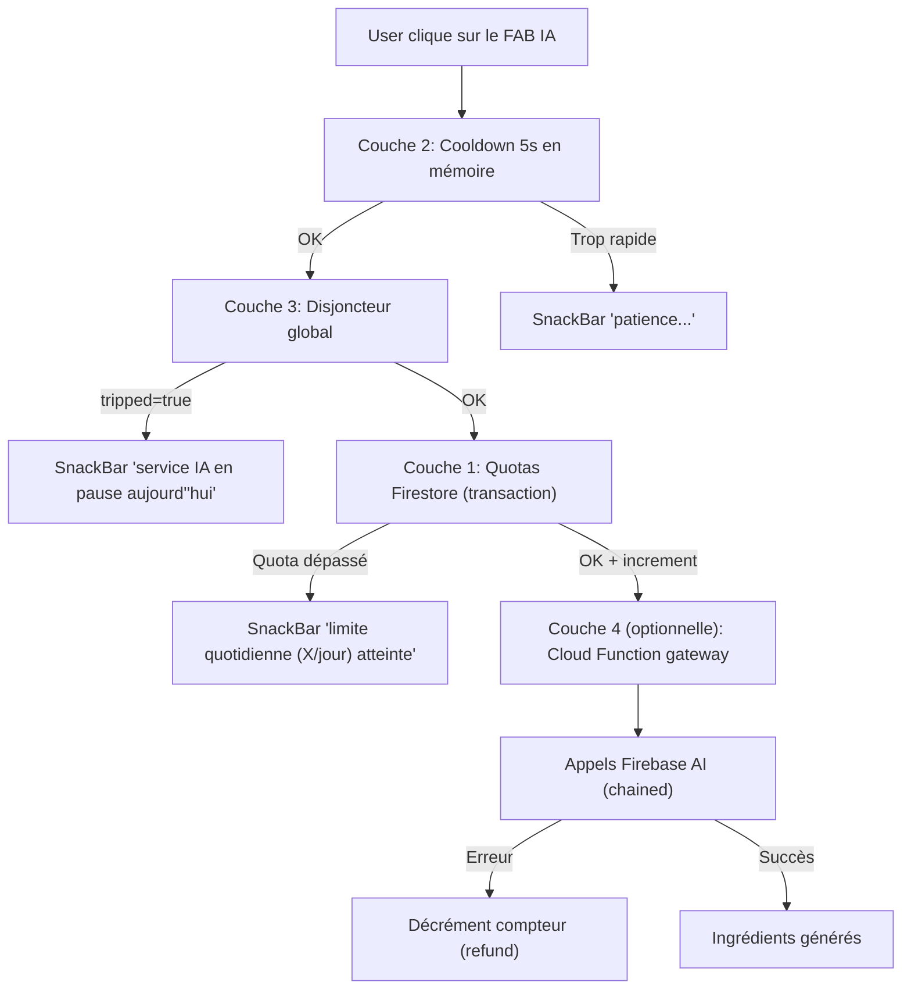

# Plan — Garde-fous d'usage IA Planerz

> **Statut :** plan (non implémenté). Brouillon de référence pour la mise en place
> de quotas et de garde-fous sur les appels Firebase AI Logic (génération
> d'ingrédients de recette, et futurs usages IA).

## Objectifs

- Empêcher un user/voyage de cramer la facture par accident ou par usage excessif.
- Protéger le free tier global de grounding Google Search (1500 prompts/jour).
- Garder un système **extensible** : un seul mécanisme générique pour la génération d'ingrédients (actif aujourd'hui) **et** les futurs usages IA (consolidation shopping, génération de menu, etc.).
- Déployer par phases pour limiter le risque et l'effort initial.

## Architecture globale



## Abstraction : `AiFeature` (générique pour tous les usages IA)

Au cœur du système, un enum extensible :

```dart
enum AiFeature {
  recipeIngredients,
  shoppingConsolidation, // futur (déjà esquissé dans la codebase)
  // mealMenuSuggestion,  // exemple d'extension future
}
```

Chaque feature a sa propre config de quotas, ce qui permet d'avoir des seuils différents selon le coût et la fréquence d'usage.

### Config (constantes Dart, simple à démarrer)

Fichier proposé : `lib/features/ai_quotas/data/ai_quota_config.dart`

```dart
class AiQuotaConfig {
  final int perUserPerDay;
  final int perTripPerDay;
  final int perTripLifetime;
  final Duration cooldown;
}

const aiQuotaConfigs = <AiFeature, AiQuotaConfig>{
  AiFeature.recipeIngredients: AiQuotaConfig(
    perUserPerDay: 30,
    perTripPerDay: 50,
    perTripLifetime: 200,
    cooldown: Duration(seconds: 5),
  ),
  // Ajouter les autres features quand elles arrivent
};
```

Migration ultérieure possible vers `system/aiQuotaConfig` Firestore si tu veux tuner sans redéployer (hors scope phase 1).

## Modèle de données Firestore

### Compteurs par utilisateur
```
users/{uid}/aiQuotas/{featureKey}
  - currentDayKey: "2026-05-07"   (YYYY-MM-DD UTC)
  - currentDayCount: 12
  - lifetimeCount: 145
  - updatedAt: <timestamp>
```

### Compteurs par voyage
```
trips/{tripId}/aiQuotas/{featureKey}
  - currentDayKey: "2026-05-07"
  - currentDayCount: 28
  - lifetimeCount: 215
  - updatedAt: <timestamp>
```

### Disjoncteur global (singleton)
```
system/aiCircuitBreaker
  - currentDayKey: "2026-05-07"
  - groundingCallsToday: 1247
  - tripped: false
  - manualOverride: "auto"  (ou "force_open" / "force_closed")
  - updatedAt: <timestamp>
```

Reset paresseux : à chaque lecture/écriture, si `currentDayKey != today` → on remet `currentDayCount: 0` et `groundingCallsToday: 0`. Pas de Cloud Scheduler nécessaire.

## Phases d'implémentation

### Phase 1 — Couches 1 + 2 (effort ~1 demi-journée)

Objectif : avoir un garde-fou client-side qui couvre 95 % des risques.

#### Fichiers à créer

- `lib/features/ai_quotas/data/ai_quota_config.dart` — config statique des quotas par `AiFeature`.
- `lib/features/ai_quotas/data/ai_quotas_repository.dart` — repo Firestore avec :
  - `Future<AiQuotaSnapshot> readQuotas(uid, tripId, feature)` (lecture des deux compteurs en parallèle, reset paresseux si dayKey périmé).
  - `Future<void> tryConsumeOne(uid, tripId, feature)` (transaction atomique : lit → vérifie 3 seuils → incrémente → throw `AiQuotaExceededException` si ko).
  - `Future<void> refundOne(uid, tripId, feature)` (decrement, en cas d'échec de l'appel IA).
- `lib/features/ai_quotas/data/ai_quota_models.dart` — types `AiFeature`, `AiQuotaSnapshot { dailyUserUsed, dailyUserMax, dailyTripUsed, dailyTripMax, lifetimeTripUsed, lifetimeTripMax }`, exception.

#### Fichiers à modifier

- [`lib/features/meals/presentation/meal_component_editor_page.dart`](../../lib/features/meals/presentation/meal_component_editor_page.dart) (méthode `_generateIngredientsWithAi`) :
  - Ajouter le check **cooldown** local (champ `DateTime? _lastAiCallAt`).
  - Avant l'appel : `await ref.read(aiQuotasRepositoryProvider).tryConsumeOne(...)`.
  - Wrap l'appel `generateRecipeIngredients` dans un `try/catch/finally` : si exception après consume, appeler `refundOne`.
  - Catcher `AiQuotaExceededException` et afficher le SnackBar approprié (« limite perso atteinte » vs « limite voyage atteinte » selon le champ qui a déclenché).
- [`lib/features/meals/presentation/meal_component_editor_page.dart`](../../lib/features/meals/presentation/meal_component_editor_page.dart) (`_GenerateRecipeDialog`) :
  - Ajouter une ligne discrète sous les inputs : *« Quotas restants : N/30 (vous) — M/50 (ce voyage) ».* Lecture via `ref.watch(aiQuotasSnapshotProvider(...))`.
  - Désactiver le bouton « Générer » si quota = 0.

#### Rules Firestore à compléter

Dans [`firestore.rules`](../../firestore.rules), ajouter :

```
match /users/{userId}/aiQuotas/{featureKey} {
  allow read: if signedIn() && request.auth.uid == userId;
  allow create, update: if signedIn()
    && request.auth.uid == userId
    && aiQuotaWriteIsValidIncrement(resource, request.resource);
}

match /trips/{tripId}/aiQuotas/{featureKey} {
  allow read: if signedIn() && isTripMember(tripId);
  allow create, update: if signedIn()
    && isTripMember(tripId)
    && aiQuotaWriteIsValidIncrement(resource, request.resource);
}
```

La fonction `aiQuotaWriteIsValidIncrement` valide :
- Soit reset (nouveau dayKey, `currentDayCount == 1`).
- Soit increment d'exactement +1 sur `currentDayCount` et `lifetimeCount`.
- Soit decrement d'exactement -1 (refund).
- Pas d'autre champ écrit en dehors de la liste autorisée.

Cela bloque tout reset arbitraire ou écriture frauduleuse côté client.

#### Tests
- Test unitaire du repo (mock Firestore) : check, refund, reset paresseux.
- Test manuel : forcer un quota à 30/30, vérifier le SnackBar et le bouton désactivé.

### Phase 2 — Couche 3 : disjoncteur global (effort ~2-3 heures)

Objectif : ne jamais dépasser 80 % du free tier grounding sans en être conscient.

#### Choix d'architecture

Le disjoncteur **doit être incrémenté de manière fiable** à chaque appel grounded. Deux options :

- **Option A (client)** : à chaque appel IA réussi côté client, on increment `system/aiCircuitBreaker.groundingCallsToday`. Rules autorisent tout user authentifié à incrémenter de +1.
- **Option B (Cloud Function dédiée)** : `incrementAiCircuitBreaker` callable, appelée par le client après succès.

**Recommandation : option A**, plus simple, suffisamment fiable pour un compteur soft cap. Le risque d'un user qui spamme cet increment pour fermer artificiellement le service est limité (admin role déjà gaté en amont).

#### Fichiers

- `lib/features/ai_quotas/data/ai_circuit_breaker_repository.dart` — repo avec :
  - `Future<bool> isTripped()` (lecture).
  - `Future<void> recordGroundingCall()` (transaction increment + auto-trip à 1200, reset paresseux).
- Provider Riverpod `aiCircuitBreakerStateProvider` (stream) pour réactivité dans l'UI.
- Modif de `_generateIngredientsWithAi` : check `isTripped` avant les autres couches, `recordGroundingCall` après chaque succès du `_callGroundedRecipe` (le 1er appel chaîné, qui consomme le free tier grounding).
- UI : si `tripped`, masquer le FAB IA (ou l'afficher mais désactivé avec tooltip explicatif). À discuter — masquer est plus propre.

#### Rules Firestore à ajouter

```
match /system/aiCircuitBreaker {
  allow read: if signedIn();
  allow create, update: if signedIn() && (
    aiCircuitBreakerWriteIsValidIncrement(resource, request.resource)
    || isApplicationOwner()  // override manuel
  );
}
```

`isApplicationOwner()` existe déjà dans [`firestore.rules`](../../firestore.rules) — réutilisable pour le `manualOverride`.

#### Note sur les seuils

- Trip à 1200/jour (= 80 % du free tier de 1500). Marge de sécurité de 300 calls.
- Pour une appli avec ~120 calls/jour estimés, on est à 8 % du free tier. Le disjoncteur ne se déclenchera jamais en pratique. C'est une **assurance**, pas un mécanisme régulier.

### Phase 3 — Couche 4 : Cloud Function gateway (effort ~1 jour, optionnelle)

Objectif : passer en enforcement serveur strict, impossible à bypasser depuis un client modifié.

#### Quand l'envisager
- À l'ouverture publique (utilisateurs non-amis).
- Si tu observes des comportements anormaux (un compte qui déclenche 1000 calls).
- Si tu veux centraliser les logs d'usage IA pour facturation/observabilité.

#### Refactor

- Créer `exports.generateRecipeIngredientsWithAi` dans [`functions/index.js`](../../functions/index.js), suivant le même pattern que `consolidateTripShoppingWithAi`.
  - Région : `europe-west9` (déjà imposé par `setGlobalOptions`).
  - Auth check : caller est admin du voyage.
  - Quotas check : transaction Firestore (lecture compteurs user + voyage + disjoncteur).
  - Appel chaîné Firebase AI côté serveur (utiliser `@google/generative-ai` ou Genkit Node).
  - Increment compteurs après succès, refund après échec.
  - Retour : `RecipeAiResult` sérialisé.
- Modifier [`lib/features/meals/data/recipe_ingredients_ai_service.dart`](../../lib/features/meals/data/recipe_ingredients_ai_service.dart) pour appeler la Cloud Function via `FirebaseFunctions.httpsCallable` au lieu de `FirebaseAI` directement.
- Ne pas supprimer le repo de quotas Phase 1 : il reste utile pour afficher les quotas restants dans le dialog (lecture seule côté client). Seul l'**enforcement** passe côté serveur.
- IAM check obligatoire après déploiement (`gcloud run services get-iam-policy ...` avec `allUsers` `roles/run.invoker`), conformément à la guideline de la repo.

#### Bonus côté serveur

- Logging structuré des usages IA dans `applicationLogs/` (pattern déjà existant dans la codebase) : feature, uid, tripId, durée, succès/échec, tokens consommés.
- Cela ouvre la porte à un dashboard admin d'usage IA (hors scope plan).

## UX / Wording

Tous les textes en français hardcodé (cohérent avec le pattern POC actuel, pas d'l10n pour cette phase). Wordings proposés :

- Cooldown : *« Patience, l'appel précédent vient juste d'être lancé. »*
- Quota user atteint : *« Vous avez atteint votre limite quotidienne de générations IA (30/jour). Réessayez demain. »*
- Quota voyage atteint : *« Ce voyage a atteint sa limite quotidienne de générations IA (50/jour). Réessayez demain. »*
- Quota voyage lifetime atteint : *« Ce voyage a atteint sa limite totale de générations IA (200). Contactez le support si nécessaire. »*
- Disjoncteur tripped : *« Le service IA est en pause pour aujourd'hui (quotas globaux atteints). Il sera de nouveau disponible demain. »*
- Quotas restants dans le dialog : *« Quotas restants : 18/30 (vous) — 42/50 (ce voyage). »*

## Ordre d'exécution recommandé

1. **Aujourd'hui/cette semaine** : Phase 1 complète. Tu es protégé contre 95 % des dérapages.
2. **Avant ouverture publique** : Phase 2. Tu es protégé contre une viralité non anticipée.
3. **Si volume réel ou abus avéré** : Phase 3. Pas avant.

## Hors scope (à mentionner pour traçabilité)

- Génération automatique de rapports d'usage IA (pourrait venir avec Phase 3).
- Gestion fine de quotas par rôle (chef vs admin vs owner) — actuellement déjà gaté admin only.
- Quotas mensuels en plus des quotidiens — pas de besoin tant que le quotidien suffit.
- Migration de la config quotas vers Firestore (admin-tunable) — possible dès Phase 1.5 si tu en vois le besoin, simple ajout d'un provider Firestore qui override les constantes.
