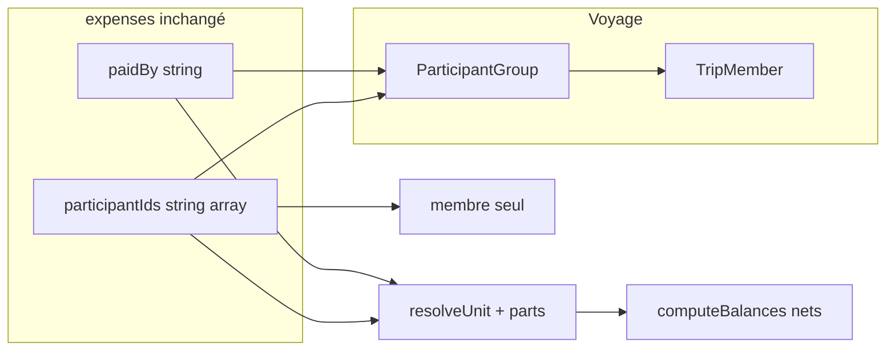

# Plan — Groupes de participants (parts) pour les dépenses

> **Statut :** plan (non implémenté). Décisions validées en session de conception + revue critique code (2026-05).

## Décisions complémentaires (revue critique)

| Sujet | Décision |
|--------|----------|
| Lignes de solde (onglet équilibres) | Itérer les **clés de `balance.nets`** (pas seulement `visibleToMemberIds`) ; même mise en page |
| Quitter le voyage / retirer un participant | **Bloquer** tant qu’il appartient à **un groupe** (le retirer du groupe d’abord) |
| Modifier un groupe référencé dans une opération | **Interdit** (comme la suppression) |
| Résolution d’un id (parts, libellé) | Lookup **`participants/{id}` d’abord**, puis `participantGroups/{id}` |
| CRUD groupes | **Firestore direct** depuis l’app + règles (`canManageTripParticipants` en écriture) |
| Libellés « Tu dois… » / « … te doit » | Comparer avec **`billingUnitId`**, pas seulement `memberId` |
| Notifications remboursement (id groupe) | **Notifier tous les membres** du groupe qui ont un `userId` |

## Objectif

Permettre de constituer des **groupes de participants** (couple, famille, etc.) avec un nombre de **parts**, utilisables comme une seule unité dans les dépenses et les soldes — sans remboursements internes au sein du groupe.

---

## Principe

- **[`TripMember`](../../lib/features/trips/data/trip_member.dart)** : inchangé (identité, séjour, claim, etc.).
- **Nouvelle entité** `trips/{tripId}/participantGroups/{groupId}` : agrégat de facturation, pas un remplacement du participant.
- **Unité de facturation** : 1 `TripMember` non groupé (**1 part**) **ou** 1 `ParticipantGroup` (**`parts`** du groupe).
- **Périmètre** : les groupes ne s’appliquent **qu’aux dépenses** et concepts dérivés (soldes par poste, suggestions de remboursement, settlements enregistrés). **Aucun** autre module du voyage (repas, chambres, activités, shopping, cupidon, etc.) — les `TripMember` restent individuels partout ailleurs.
- **Dépense (persistance)** : champs existants (`paidBy`, `participantIds`, `participantShares`, settlements `from`/`to`) — **même format** (`string` / `string[]` / `Map<string,number>`). La valeur peut être un id `participants/*` **ou** `participantGroups/*` ; **pas de nouveau champ** sur [`TripExpense`](../../lib/features/expenses/data/expense.dart) ni modèles dérivés ([`GroupBalance`](../../lib/features/expenses/data/group_balance.dart), [`SuggestedReimbursement`](../../lib/features/expenses/data/suggested_reimbursement.dart)).
- **Calcul** : avant répartition, `resolveUnit(id)` charge `participantGroups` et retourne les `parts` (1 ou `group.parts`).



---

## Modèle Firestore

`participantGroups/{groupId}` :

| Champ | Type | Règle |
|-------|------|--------|
| `label` | string | obligatoire à la création (affichage) |
| `memberIds` | string[] | IDs `participants/*`, minimum **2** |
| `parts` | number | > 0, ex. `2`, `2.5` |
| `createdAt` / `updatedAt` | timestamp | |

**Persistance groupes** : écriture **Firestore directe** (repository Dart) ; règles `match /participantGroups/{groupId}` — lecture `isTripMember`, écriture `canManageTripParticipants` (aligné sur [`participants`](../../firestore.rules)).

**Contraintes produit (CF + client)** :

- Un `TripMember` dans **au plus un** groupe.
- Membre d’un groupe **jamais** stocké seul dans `paidBy` / `participantIds` d’une dépense (seul l’id du groupe).
- **Modification ou suppression groupe** : **interdites** si son id apparaît dans une opération (`paidBy`, `participantIds`, `participantShares`, settlement). Pas de dissolution ni recalcul historique.
- **Suppression / départ participant** : bloquer s’il appartient encore à **un groupe** (quel qu’il soit) ; bloquer aussi s’il est référencé directement dans une dépense. Étendre [`assertMemberRemovalBlockingDependencies`](../../functions/index.js) / [`leaveTrip`](../../functions/index.js) + [`assertMemberNotUsedInExpenses`](../../functions/index.js).

---

## Dépense — persistance (inchangée)

Aucun changement de **forme** des modèles / documents Firestore dépenses :

| Champ existant | Sémantique élargie |
|----------------|-------------------|
| `paidBy` | id participant **ou** id groupe |
| `participantIds` | liste d’ids participant **ou** groupe (jamais un membre déjà dans un groupe) |
| `participantShares` | clés = mêmes ids |
| `fromParticipantId` / `toParticipantId` (suggestions, settlements) | id participant **ou** groupe |

**Résolution** (helper partagé client + [`participantSharesForExpense`](../../functions/expense_settlement.js)) — **seul point d’évolution algo** :

```
resolveUnit(id, groupsMap, membersMap) → parts
  id ∈ participants (priorité)  → 1
  sinon id ∈ participantGroups → group.parts
  inconnu → fallback 1 ou erreur validation à l’écriture
```

Même ordre pour les **libellés** (`tripExpenseUnitLabelsProvider`).

**Répartition** (`splitMode: equal`, pondéré par parts) sur `participantIds` :

```
share(id) = amount × parts(id) / Σ parts(participantIds)
```

**Soldes (`nets`)** — clés = ces mêmes ids (membre ou groupe), **pas de ventilation** vers `memberIds` :

```
nets[paidBy] += amount
pour chaque id dans participantIds : nets[id] -= share(id)
```

- `customAmounts` : clés inchangées ; somme ±0,02 €.
- **Suggestions** : [`suggestTransfers`](../../functions/expense_settlement.js) inchangé (greedy, minimise le nombre de virements) ; entrée/sortie = mêmes champs, ids pouvant être des groupes.
- **Remboursement enregistré** ([`markExpenseReimbursementPaid`](../../functions/expense_settlement_recalc.js)) : si `toParticipantId` ou `fromParticipantId` est un **groupe**, notifier **chaque membre** du groupe ayant un `userId` (étendre `resolveParticipantData` / file notification).
- **Vue utilisateur connecté** : `billingUnitId(memberId)` → `groupId` si membre groupé, sinon `memberId` (voir filtres ci‑dessous).
- Voyages sans groupes → comportement strictement identique à aujourd’hui.

---

## Calcul / sync

Fichiers à aligner (même algo) :

- [`functions/expense_settlement.js`](../../functions/expense_settlement.js)
- [`scripts/expense_settlement.js`](../../scripts/expense_settlement.js)
- `tripExpenseUnitLabelsProvider` (ou équivalent) consommé par les écrans dépenses ; pas de logique de label inline dans les widgets
- Tests [`functions/expense_settlement.test.js`](../../functions/expense_settlement.test.js)

`computeBalances` charge les groupes du voyage (ou snapshot passé au recalc) une fois par batch.

---

## UI (scope v1)

### Gestion des participants — nouvel onglet

[`trip_participants_page.dart`](../../lib/features/trips/presentation/trip_participants_page.dart) : ajouter un **`TabBar` / `TabBarView`** (même page, pas de route séparée).

| Onglet | Contenu |
|--------|---------|
| **Participants** (existant) | Liste / ajout / édition des voyageurs — inchangé |
| **Groupes** (nouveau) | Constitution et gestion des groupes de facturation |

**Onglet Groupes** : visible pour tous ; **lecture seule** si `manageParticipants` absent (pas de création / édition / suppression) :

- Liste des groupes du voyage (label, membres résumés, `parts`).
- **Créer / modifier** (dialog ou page secondaire légère) :
  - **Label** (obligatoire, ex. « A&B », « Famille Martin »).
  - **Membres** : sélection multi parmi les `TripMember` **non déjà dans un autre groupe** ; minimum **2**.
  - **Parts** : par défaut = **nombre de membres du groupe** ; champ **éditable à la main** (nombre > 0, décimales autorisées — ex. 2,5).
- **Modifier / supprimer** un groupe : autorisé **uniquement** s’il n’apparaît dans aucune opération ; sinon actions désactivées + message l10n.
- l10n : libellés onglet, actions, validations (min 2 membres, parts invalides, membre déjà groupé, groupe utilisé dans des dépenses).

### Dépenses (v1)

[`trip_expenses_page.dart`](../../lib/features/expenses/presentation/trip_expenses_page.dart) — **payeur** et **concernés** : **même liste d’unités** :

- Membres **non groupés** (individuels).
- **Groupes** entiers (une entrée = une unité de facturation).
- **Jamais** les `TripMember` qui appartiennent déjà à un groupe (ni en payeur, ni en concerné).

Règle produit : un groupe **paie** ou **est concerné** en bloc ; l’app ne modélise pas qui paie quoi **à l’intérieur** du groupe (compte commun / arrangement hors app).

Sélection payeur / concernés : liste = membres non groupés + groupes (ids stockés dans les champs existants). Étendre le périmètre poste au-delà de [`participantScopeMemberIdsForGroup`](../../lib/features/expenses/presentation/trip_expenses_page.dart) : unités dont tous les `memberIds` ⊆ `visibleToMemberIds` (ou membre seul visible).

Côté client : **validation** à l’ajout/édition (pas de membre groupé en solo ; ids résolvables) — les règles Firestore `expenses` restent permissives.

### Soldes & remboursements (UI existante — ne pas refactoriser)

Écrans / widgets actuels (liste des `nets`, suggestions, settlements faits) : **mise en page et structure inchangées**.

Changements ciblés :

- **Nom affiché** : résolution via `tripExpenseUnitLabelsProvider` (participant ou groupe).
- **Liste des soldes par devise** : itérer les **clés de `balance.nets`** (tri stable), et non plus principalement `visibleToMemberIds` — sinon les groupes n’apparaissent pas.

Pas de regroupement visuel supplémentaire : une clé de `nets` = une ligne.

### Filtres « Tous / Moi » (comportement existant, élargi aux groupes)

Filtres actuels : opérations (`_showAllOperations` + `involvesMember`) ; onglet équilibres — suggestions et remboursements enregistrés (`_showAllPost` + `_involvesCurrentUser`).

**Règle** : résoudre `viewerBillingUnitId = billingUnitId(currentUserMemberId)` une fois par écran.

| Filtre « Moi » | Avant | Après |
|----------------|-------|-------|
| Liste opérations | `expense.involvesMember(memberId)` | `expense.involvesUnit(viewerBillingUnitId)` — `paidBy`, `participantIds` ou clé `participantShares` |
| Suggestions | `from` / `to` == `memberId` | `from` / `to` == `viewerBillingUnitId` |
| Settlements enregistrés | idem `involvesMember` | idem `involvesUnit` |
| Participant solo | = comportement actuel | `viewerBillingUnitId` == `memberId` |

Helper partagé (ex. `expenseInvolvesBillingUnit(expense, unitId)`) — pas de duplication dans chaque filtre.

**En-tête poste** (« mes totaux » / « ma part ») : agrégats indexés par `viewerBillingUnitId` dans `summary` / boucle coût, pas par `memberId` seul si l’utilisateur est dans un groupe.

« Tous » : inchangé (toutes les opérations / tous les remboursements visibles).

**Libellés personnalisés remboursements** ([`_reimbursementLabel`](../../lib/features/expenses/presentation/trip_expenses_page.dart)) : comparer `from` / `to` avec **`viewerBillingUnitId`**, pas `currentUserMemberId` seul.

### Résolution des libellés (factorisée, réutilisable)

Sur le modèle existant participants ([`tripMemberLabelsFromMembers`](../../lib/features/auth/data/user_display_label.dart), [`tripMemberResolvedLabelsProvider`](../../lib/features/trips/data/trip_members_repository.dart)) :

| Couche | Participants (existant) | Groupes (à ajouter) |
|--------|----------------------|---------------------|
| Fonction pure | `resolveTripMemberDisplayLabel` / `tripMemberLabelsFromMembers` | `resolveParticipantGroupDisplayLabel` / `participantGroupLabelsFromGroups` → `group.label` |
| Provider Riverpod | `tripMemberResolvedLabelsProvider(tripId)` | `tripParticipantGroupLabelsProvider(tripId)` → `Map<groupId, String>` |
| Résolution d’un id dépense | — | `tripExpenseUnitLabelsProvider(tripId)` : lookup **participant d’abord**, puis groupe ; **une seule API** pour dépenses / soldes / suggestions |

Règles :

- Pas de libellés groupes en dur dans les widgets ; toujours via provider / helper.
- Périmètre dépenses : le provider fusionné vit côté `expenses` ou `trips/data` selon dépendances, mais les helpers groupes restent réutilisables (détail dépense, onglet Groupes, etc.).

**Hors périmètre (toutes versions tant que non spécifié)** : repas, chambres, activités, listes, votes, profils, invitations, etc. — aucune référence à `participantGroups` en dehors du fil dépenses.

---

## Permissions

Réutiliser `permissions.participants.manageParticipants` (ou équivalent existant) pour gérer les groupes ; lecture pour tous les participants du voyage.

---

## Ce qu’on évite

- Pas d’usage des groupes hors **dépenses + dérivés** (ne pas toucher aux collections / écrans repas, chambres, activités, …).
- Pas de fusion groupes / [`expenseGroups`](../../lib/features/expenses/data/expense_group.dart) (postes de dépense ≠ groupes de voyageurs).
- Pas de modification du schéma `TripMember` ni des **champs** des modèles dépense / balance / suggestion / settlement.
- Pas de refonte UI des écrans soldes & remboursements (libellés + itération `nets` uniquement).
- **Pas de ventilation des montants vers les `memberIds`** (ni pour soldes, ni pour suggestions) — c’est le cœur métier du regroupement.
- Pas de stockage de parts par membre sur chaque dépense (résolution via le groupe).
- Pas de suppression de groupe « en cascade » sur les dépenses existantes.

---

## Scénario de référence (validé)

Pierre, Sabine ; groupe A&B (`parts=2`, Alice+Bob). Deux dépenses 100 €, concernés : Pierre, Sabine, A&B (4 parts → 25 € / part unitaire).

| | Pierre | Sabine | A&B |
|--|--------|--------|-----|
| T0 Sabine paie | −25 | +75 | −50 |
| T1 A&B paient | −25 | −25 | +50 |
| **nets** | **−50** | **+50** | **0** |

Suggestion : **Pierre → Sabine, 50 €** (pas 25+25). Décomposition bilatérale par dépense = lecture informative seulement.

---

## Hors scope v1 (extensions possibles)

- Répartition **interne** au groupe, sélection mixte groupe + membre du même groupe, ou membre groupé en individuel dans une dépense.
- Migration auto des dépenses historiques vers des groupes.

---

## Tâches d’implémentation

- [ ] Collection `participantGroups` + modèle Dart + repository + règles Firestore (écriture directe)
- [ ] `resolveUnit` + parts dans `participantSharesForExpense` (CF + script + tests, dont scénario Pierre/Sabine/A&B)
- [ ] `computeBalances` / suggestions / settlements sur ids unitaires
- [ ] Notifications remboursement : membres du groupe si id groupe
- [ ] Onglet Groupes dans `TripParticipantsPage`
- [ ] Sélection unités dépenses + validation client + périmètre poste étendu
- [ ] Soldes : itération `balance.nets` + libellés ; filtres Tous/Moi + `_reimbursementLabel` via `billingUnitId`
- [ ] Blocage édition/suppression groupe si référencé ; blocage départ participant si encore dans un groupe
