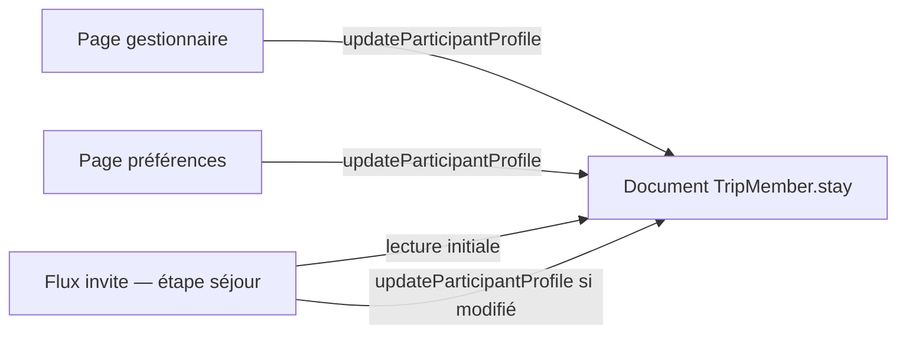
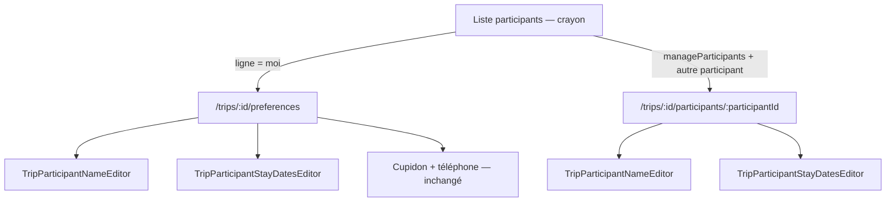

# Plan : informations de voyage d'un participant (gestionnaire + préférences)

## Contexte et objectif

Depuis la liste des participants à un voyage, les utilisateurs disposant de la permission **Gérer les participants** (`manageParticipants`) doivent pouvoir consulter et modifier les **informations de voyage** d'un participant donné via une **page dédiée**.

Aujourd'hui, l'icône crayon sur un participant ouvre uniquement une popup (`TripParticipantNameDialog`) pour choisir le nom affiché. L'objectif est de :

- Remplacer cette popup par une **page dédiée** pour les gestionnaires (autre participant).
- Y regrouper le **choix du nom affiché** et les **dates de présence** (même rendu que lorsque le participant édite ses propres préférences).
- Rediriger un participant vers **ses préférences** lorsqu'il édite sa propre ligne, et y ajouter le contrôle d'affichage du nom (lié aux infos de voyage).
- **Factoriser** les contrôles nom et dates pour les réutiliser partout où nécessaire.

---

## Décisions produit (validées)

| Point | Décision |
|-------|----------|
| Crayon sur sa propre ligne | Redirection vers `/trips/:tripId/preferences` |
| Page préférences | Ajouter le contrôle d'affichage du nom (en plus des dates, Cupidon, téléphone) |
| Sauvegarde des dates | Modification **en live** (comme aujourd'hui sur la page préférences) |
| Sauvegarde du nom | **Bouton Enregistrer** (comme le dialog actuel) |
| Cupidon / téléphone | Uniquement sur la page préférences — **pas** sur la page gestionnaire |
| Participants non revendiqués | Page gestionnaire applicable (nom, enfant, dates éditables par un admin) |
| Permission | Réutiliser `manageParticipants` existante — pas de permission dédiée |
| Factorisation | Contrôle nom et contrôle dates entièrement réutilisables |
| Flux rejoindre un voyage (invite) | Les dates proposées à l'étape « séjour » doivent refléter celles **déjà en base** sur le document `TripMember` du slot choisi |

---

## Source de vérité unique pour les dates de séjour

Les dates de présence d'un participant (`stayStartDateKey`, `stayStartDayPart`, `stayEndDateKey`, `stayEndDayPart` sur `trips/{tripId}/participants/{participantId}`) sont **les mêmes champs**, quelle que soit l'origine de la modification :

| Acteur | Moment | Mécanisme |
|--------|--------|-----------|
| Admin / gestionnaire | Avant revendication (voyageur prévu) | Page gestionnaire → `updateParticipantProfile` |
| Admin / gestionnaire | Après revendication | Page gestionnaire → `updateParticipantProfile` |
| Participant | Rejoindre le voyage (invite) | Étape séjour → `updateParticipantProfile` après claim |
| Participant | Plus tard | Page préférences → `updateParticipantProfile` |

**Conséquence produit :** lorsqu'un utilisateur rejoint un voyage et choisit un slot parmi les voyageurs prévus, l'écran de sélection des dates (bornes repas incluses) doit **préremplir** l'éditeur avec les dates **déjà stockées** sur ce slot — y compris si un admin les a ajustées avant la revendication. Le participant peut toujours les modifier avant de valider ; s'il ne les touche pas, les valeurs en base restent cohérentes.



### État du code au moment du plan

L'architecture de données le permet nativement (un seul document participant). Le flux invite calcule aujourd'hui les dates **à la volée** depuis les bornes du voyage (`TripMemberStay.defaultForInviteContext`), sans lire le `stay` du slot.

**Pourquoi c'est équivalent dans le cas nominal :** à la création d'un voyageur prévu (`addTripParticipant`), le serveur écrit déjà sur le document participant les mêmes champs `stay*` via `defaultStayForTrip` — logique calquée sur `defaultForInviteContext`. Tant qu'aucun admin n'a modifié les dates, lire le participant en base ou recalculer depuis le voyage **donne le même résultat**.

**Pourquoi lire en base malgré tout :** une seule source de vérité (le document `TripMember`) ; si un admin a ajusté les dates avant revendication, l'écran de rejoindre le voyage doit proposer **ces** valeurs, pas un recalcul aveugle depuis le voyage. C'est le seul cas où le comportement change réellement.

**Travail attendu (alignement, pas refonte) :** exposer le `stay` de chaque slot dans `getInviteJoinContext`, initialiser (et réinitialiser au changement de slot) `_stayDraft` depuis ces valeurs, avec repli sur `defaultForInviteContext` uniquement si le document n'a pas de `stay` valide (rétrocompatibilité). Aucun nouveau modèle ni nouvelle API de persistance.

---

## État actuel (référence code)

| Élément | Fichier / route |
|---------|-----------------|
| Liste participants | [`lib/features/trips/presentation/trip_participants_page.dart`](../../lib/features/trips/presentation/trip_participants_page.dart) |
| Crayon | Visible si `canManageParticipants` **ou** si c'est sa propre ligne |
| Action crayon actuelle | Ouvre `TripParticipantNameDialog` → `updateTripParticipantName` |
| Préférences perso | [`/trips/:tripId/preferences`](../../lib/features/trips/presentation/trip_member_preferences_page.dart) — `TripMemberStayOptionsEditor` (dates + Cupidon + téléphone) |
| Dialog nom | [`lib/features/trips/presentation/trip_participant_name_dialog.dart`](../../lib/features/trips/presentation/trip_participant_name_dialog.dart) |
| Champ dates (bas niveau) | [`lib/features/trips/presentation/trip_calendar_stay_bounds_field.dart`](../../lib/features/trips/presentation/trip_calendar_stay_bounds_field.dart) |
| Éditeur dates + options | [`lib/features/trips/presentation/trip_member_stay_options_editor.dart`](../../lib/features/trips/presentation/trip_member_stay_options_editor.dart) |
| Mise à jour dates (CF) | `updateParticipantProfile` — autorisé pour le participant lui-même ou un gestionnaire |
| Flux invite — préremplissage dates | `TripMemberStay.defaultForInviteContext` (bornes voyage) — **à aligner** sur le `stay` du slot (voir section ci-dessus) |
| Route participants | `/trips/:tripId/participants` — pas encore de sous-route par participant |

---

## Parcours utilisateur



### Règle crayon (`trip_participants_page.dart`)

- `row.userId == monUid` → `context.push('/trips/$tripId/preferences')`
- `canManageParticipants` et autre participant → `context.push('/trips/$tripId/participants/$participantId')`
- Sinon → pas de crayon

Un gestionnaire qui édite **sa propre** ligne va vers **préférences**, pas la page admin.

---

## Factorisation (cœur du chantier)

### A. `TripParticipantNameEditor`

Extraire le contenu de `TripParticipantNameDialog` en widget autonome :

- Choix nom personnalisé / nom profil
- Champ texte ou aperçu profil
- Switch « enfant » (participants non revendiqués uniquement)
- Bouton **Enregistrer** intégré (ou callback `onSave` + état `_canSave`)

`TripParticipantNameDialog` devient un simple `AlertDialog` qui emballe ce widget — **sans changer** les flux invite / création de voyage.

| Emplacement | Rôle |
|-------------|------|
| `TripParticipantNameDialog` | Flux existants (invite, création, etc.) |
| `TripMemberPreferencesPage` | Participant édite son propre nom |
| `TripParticipantTravelInfoPage` | Gestionnaire édite le nom d'un autre |

**Sauvegarde :** `tripsRepository.updateTripParticipantName(...)` — API inchangée.

### B. `TripParticipantStayDatesEditor`

Widget de plus haut niveau, réutilisable :

- `Card` + padding (même rendu que l'onglet dates de `TripMemberStayOptionsEditor`)
- Titre optionnel (clé l10n `tripStayPresenceDatesTitle`)
- `TripCalendarStayBoundsField` à l'intérieur
- Mode **live** : `onChanged` async avec validation (`TripMemberStay.isChronological`, `withinTripCalendarBounds`) + SnackBar d'erreur

| Emplacement | Rôle |
|-------------|------|
| `TripMemberStayOptionsEditor` | Onglet dates (remplace le bloc inline actuel) |
| `TripParticipantTravelInfoPage` | Gestionnaire édite les dates d'un participant |
| Création / invite (mode draft) | Bénéfice indirect via `TripMemberStayOptionsEditor` |

`TripMemberStayOptionsEditor` conserve ses onglets dates / options (Cupidon + téléphone) pour la page préférences ; il **consomme** `TripParticipantStayDatesEditor`.

---

## Page gestionnaire : `TripParticipantTravelInfoPage`

### Route

```
/trips/:tripId/participants/:participantId
```

Enfant de la route `participants` dans [`lib/app/router.dart`](../../lib/app/router.dart). Retour → liste participants.

### Contenu

1. **AppBar** — titre (ex. « Informations de voyage ») + contexte participant
2. **`TripParticipantNameEditor`** — sauvegarde explicite
3. **`TripParticipantStayDatesEditor`** — live, masqué si `trip.isDayTrip`

**Absent :** Cupidon, visibilité téléphone, quitter le voyage.

### Données

- Provider `tripParticipantByIdProvider(tripId, participantId)` dérivé de `tripParticipantsStreamProvider`
- Profil utilisateur si participant revendiqué + `useProfileName` (même pattern que la liste)

### Garde d'accès

- `canManageTripParticipantsForUser` requis
- Participant introuvable → message + retour

### Sauvegarde dates

`tripMembersRepository.updateParticipantProfile(tripId, participantId, stay: …)` — backend déjà prêt pour gestionnaires et participants non revendiqués.

---

## Page préférences : enrichissement

[`TripMemberPreferencesPage`](../../lib/features/trips/presentation/trip_member_preferences_page.dart) :

1. **Ajouter** `TripParticipantNameEditor` en haut (avant `TripMemberStayOptionsEditor`)
2. Charger `myTripMemberStreamProvider` pour `participantName`, `useProfileName`, `isChild`, `id`
3. Sauvegarde nom via `updateTripParticipantName` sur le participant courant

Le reste (dates live, Cupidon, téléphone, quitter le voyage) reste en place.

---

## Fichiers touchés (estimation)

| Fichier | Action |
|---------|--------|
| `lib/features/trips/presentation/trip_participant_name_editor.dart` | **Nouveau** — widget factorisé |
| `lib/features/trips/presentation/trip_participant_stay_dates_editor.dart` | **Nouveau** — widget factorisé |
| `lib/features/trips/presentation/trip_participant_name_dialog.dart` | Refactor → wrapper du name editor |
| `lib/features/trips/presentation/trip_participant_travel_info_page.dart` | **Nouveau** — page gestionnaire |
| `lib/features/trips/presentation/trip_member_preferences_page.dart` | + name editor |
| `lib/features/trips/presentation/trip_member_stay_options_editor.dart` | Consomme stay dates editor |
| `lib/features/trips/presentation/trip_participants_page.dart` | Navigation crayon selon règles |
| `lib/features/trips/data/trip_members_repository.dart` | Provider participant par ID |
| `lib/app/router.dart` | Sous-route `participants/:participantId` |
| `lib/l10n/app_fr.arb`, `app_fr_FR.arb`, `app_en.arb`, `app_en_US.arb` | Titre page gestionnaire, libellés si besoin |
| `lib/features/trips/presentation/invite_join_page.dart` | Préremplissage `_stayDraft` depuis le `stay` du slot choisi |
| `lib/features/trips/data/invite_join_context.dart` | Modèle enrichi (séjour par slot) |
| `lib/features/trips/data/trips_repository.dart` | Parsing du contexte invite enrichi |
| `functions/index.js` (`getInviteJoinContext`) | Exposer les champs `stay*` de chaque slot non revendiqué |

**Backend :** pas de nouvelle persistance ; extension de lecture dans `getInviteJoinContext` uniquement (`updateParticipantProfile` et `updateTripParticipantName` couvrent déjà l'écriture).

---

## Règles Firestore (`firestore.rules`)

### Synthèse

**Aucune modification des règles Firestore n'est attendue** pour ce plan, à condition de conserver les chemins d'écriture existants (client direct pour le nom, Cloud Function pour le séjour). Le plan doit toutefois documenter ces règles pour éviter toute confusion à l'implémentation.

### Règles en vigueur sur `trips/{tripId}/participants/{participantId}`

| Opération | Règle | Impact sur ce plan |
|-----------|-------|-------------------|
| **read** | `isTripMember(tripId)` | Tout membre du voyage peut lire tous les participants (y compris `stay*`). Suffisant pour la page gestionnaire, la liste et les streams Riverpod **après** adhésion. |
| **update** (client direct) | `canManageTripParticipants(tripId)` **ou** (`isTripMember` **et** `resource.data.userId == request.auth.uid`) | Champs autorisés **uniquement** : `participantName`, `useProfileName`, `isChild`. |
| **update** — champs limités | `affectedKeys().hasOnly(['participantName', 'useProfileName', 'isChild'])` | Les champs `stayStartDateKey`, `stayStartDayPart`, `stayEndDateKey`, `stayEndDayPart`, `phoneVisibility`, `cupidonEnabled` **ne peuvent pas** être modifiés en écriture directe depuis le client. |
| **update** — `isChild` | Réservé aux gestionnaires, et seulement si le document **n'a pas** de `userId` (non revendiqué) | Cohérent avec le switch enfant sur la page gestionnaire. |
| **create** | `canManageTripParticipants` (voyageur prévu via CF `addTripParticipant`) ou cas spécial claim propriétaire à la création du voyage | Hors changement : création inchangée. |
| **delete** | `canManageTripParticipants` | Inchangé. |

Référence : [`firestore.rules`](../../firestore.rules), bloc `match /participants/{participantId}` (lignes ~619–658).

### Correspondance écritures ↔ chemin autorisé

| Donnée | Mécanisme actuel | Règles Firestore |
|--------|------------------|------------------|
| Nom, `useProfileName`, `isChild` | `tripsRepository.updateTripParticipantName` → **update Firestore direct** | Couvert par la règle `update` ci-dessus (gestionnaire ou soi-même pour nom / profil ; `isChild` gestionnaire + non revendiqué). |
| Dates de séjour (`stay*`) | `tripMembersRepository.updateParticipantProfile` → **CF `updateParticipantProfile`** | Admin SDK côté serveur — **hors** règles client ; la CF applique déjà `manageParticipants` si `participantId ≠ uid`. |
| `phoneVisibility`, `cupidonEnabled` | CF dédiées (`updateParticipantProfile`, `setTripCupidonEnabled`) | Idem — pas d'écriture client sur ces champs. |

**À ne pas faire à l'implémentation :** tenter de persister les dates via `participantRef.update({ stayStartDateKey: … })` depuis le client — sera **refusé** par les règles.

### Lecture avant adhésion au voyage (flux invite)

Un utilisateur qui **n'est pas encore** membre du voyage n'a **pas** le droit de lire `trips/{tripId}/participants/*` (`read` exige `isTripMember`).

Conséquence : le préremplissage des dates à l'invite **ne peut pas** s'appuyer sur une lecture Firestore directe depuis le client avant le join. D'où l'extension de **`getInviteJoinContext`** (Cloud Function, Admin SDK) pour renvoyer le `stay` de chaque slot — **sans** assouplir les règles Firestore.

### Cas où une mise à jour des règles serait nécessaire (hors scope actuel)

Les règles devraient être revues **uniquement** si l'implémentation déviait de l'architecture actuelle, par exemple :

- écriture client directe des champs `stay*` (déconseillé — la validation métier est dans la CF) ;
- lecture des participants par des non-membres (ex. invité anonyme) sans passer par une CF ;
- nouveaux champs sur le document participant non couverts par les `affectedKeys()` autorisés.

Aucun de ces écarts n'est prévu par ce plan.

### Déploiement

Si les règles restent inchangées : **pas de** `firebase deploy --only firestore:rules` pour cette fonctionnalité.

---

## Ordre d'implémentation

1. **`TripParticipantNameEditor`** + refactor du dialog (vérifier invite / création voyage)
2. **`TripParticipantStayDatesEditor`** + refactor de `TripMemberStayOptionsEditor`
3. **Provider** participant par ID
4. **`TripParticipantTravelInfoPage`** + route
5. **Navigation** liste participants (règles crayon)
6. **Enrichissement** `TripMemberPreferencesPage` avec le name editor
7. **Flux invite** — préremplissage des dates depuis le `stay` du slot (`getInviteJoinContext` + `invite_join_page`)
8. **`flutter analyze`** + tests manuels

---

## Scénarios de test

| Scénario | Attendu |
|----------|---------|
| Gestionnaire → crayon sur voyageur prévu | Page admin : nom + dates éditables, switch enfant |
| Gestionnaire → crayon sur membre revendiqué | Page admin : nom (profil / custom) + dates |
| Participant → crayon sur sa ligne | `/preferences` avec nom + dates + Cupidon / téléphone |
| Gestionnaire → sa propre ligne | `/preferences` (pas page admin) |
| Voyage d'une journée | Dates masquées sur les deux pages |
| Sans `manageParticipants` → autre ligne | Pas de crayon |
| Dates invalides | SnackBar, pas de persistance |
| Nom invalide | Bouton Enregistrer désactivé |
| Dialog invite / création voyage | Comportement inchangé après refactor (nom) |
| Admin modifie dates d'un voyageur prévu, puis revendication | L'étape séjour de l'invite affiche les dates admin ; modification possible avant validation |
| Changement de slot à l'invite | Les dates proposées suivent le `stay` du nouveau slot sélectionné |

---

## Hors scope

- Nouvelle permission dédiée
- Cupidon et visibilité téléphone sur la page gestionnaire
- Migration de données
- Modification des règles Firestore (aucune requise — voir section dédiée ci-dessus)
