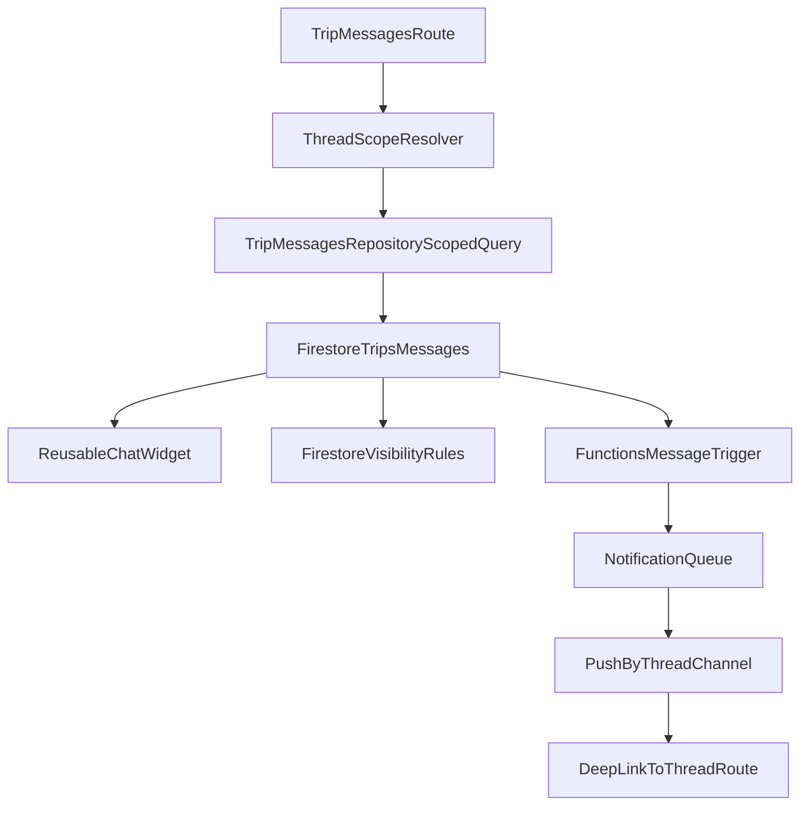

# Plan — Messagerie multi-instances réutilisable (sans migration lourde)

## Objectif produit
Permettre plusieurs messageries par voyage (principale, admins, covoiturage, etc.) via un composant unique, tout en conservant la compatibilité des messages existants et en évitant une migration massive des données en production.

## Exigence non négociable — Parité fonctionnelle et visuelle
- Toute nouvelle instance de messagerie doit exposer toutes les capacités de la messagerie actuelle, sous la même forme visuelle (mêmes interactions, hiérarchie visuelle, composants, densité et comportements UI).
- Parité attendue a minima (liste non exhaustive):
  - publication de messages;
  - affichage émetteur + différenciation visuelle messages “moi/autres”;
  - réactions emojis sur messages;
  - édition/suppression/copie selon les mêmes règles que l’existant;
  - prise en charge des liens hypertexte (rendu + ouverture);
  - pagination/messages anciens, états de chargement, et feedback erreurs identiques.
- Interdiction d’une version “allégée” d’instance: toute divergence fonctionnelle ou visuelle doit être explicitement validée produit avant implémentation.

## Décisions d’architecture validées
- Stockage: conserver `trips/{tripId}/messages` comme collection unique, et ajouter des champs de contexte de thread.
- Compatibilité legacy: un message existant sans champs de contexte est interprété comme `threadType=main`.
- Visibilité: modèle déclaratif (`visibilityType`) + résolution dynamique des membres (pas de snapshot d’UID par message).
- Notifications: planifier dès maintenant des canaux séparés par instance, mais les implémenter dans un lot distinct après stabilisation du cœur multi-instances.

## Modèle cible (phase 1, compatible legacy)
Dans chaque document message de `trips/{tripId}/messages/{messageId}`, introduire:
- `threadType` (`main`, `admin`, `object`)
- `threadObjectType` (nullable, ex: `carpool`, `activity`, `announcement`)
- `threadObjectId` (nullable)
- `visibilityType` (`trip_all`, `admins_only`, `object_participants`)

Règle de lecture legacy:
- si `threadType` absent -> traiter comme `main`
- si `visibilityType` absent -> traiter comme `trip_all`

## Lots d’implémentation

### Lot 1 — Contrat domaine et adaptation repository (sans casser l’existant)
- Étendre [c:\repo\Planzers\lib\features\messaging\data\trip_message.dart](c:\repo\Planzers\lib\features\messaging\data\trip_message.dart) pour parser les nouveaux champs avec defaults legacy.
- Introduire des objets de requête thread (ex: `TripMessageThreadScope`) dans [c:\repo\Planzers\lib\features\messaging\data\trip_messages_repository.dart](c:\repo\Planzers\lib\features\messaging\data\trip_messages_repository.dart).
- Faire évoluer les méthodes `watchRecentChatData`, `fetchOlderChatPage`, `sendMessage`, `updateMessage`, `deleteMessage`, `setMyReaction`, `removeMyReaction` pour prendre un scope de thread.
- Garantir que l’appel “chat principal” actuel continue de fonctionner sans changement fonctionnel.

### Lot 2 — Composant de messagerie réellement réutilisable
- Conserver [c:\repo\Planzers\lib\features\messaging\presentation\chat_widget.dart](c:\repo\Planzers\lib\features\messaging\presentation\chat_widget.dart) comme composant UI neutre (déjà découplé), et formaliser un contrat d’intégration unique pour toutes les instances.
- Transformer [c:\repo\Planzers\lib\features\messaging\presentation\trip_messaging_page.dart](c:\repo\Planzers\lib\features\messaging\presentation\trip_messaging_page.dart) en wrapper paramétré par thread (main/admin/object), au lieu d’une page implicite “messages principal”.
- Créer un wrapper “instance chat” réutilisable (ex: `TripThreadMessagingPage`) utilisé par chaque future messagerie.
- Ajouter une checklist de parité obligatoire (fonctionnelle + visuelle) avant validation de chaque nouvelle instance.

### Lot 3 — Routage et instanciation multi-messageries
- Ajouter une stratégie de routing thread-safe dans [c:\repo\Planzers\lib\app\router.dart](c:\repo\Planzers\lib\app\router.dart):
  - `.../messages` -> thread principal
  - `.../messages/admin` -> thread admin
  - `.../messages/object/:objectType/:objectId` -> thread objet (ex: covoiturage)
- Prévoir les garde-fous d’accès (membre/admin/participants objet) côté UI + repository.

### Lot 4 — Sécurité Firestore compatible legacy
- Étendre [c:\repo\Planzers\firestore.rules](c:\repo\Planzers\firestore.rules):
  - autoriser les nouveaux champs au create/update,
  - conserver les contraintes auteur/édition/réaction existantes,
  - ajouter règles de visibilité selon `visibilityType` et appartenance (admin, participants objet).
- Assurer que les documents sans nouveaux champs restent lisibles comme thread principal.

### Lot 5 — Données existantes et stratégie “zéro migration obligatoire”
- Ne pas lancer de migration bulk.
- Ne pas introduire de backfill (ni batch, ni opportuniste, ni script progressif).
- Considérer le chat principal comme modèle nominal durable:
  - les messages principaux existants peuvent rester sans champs `thread*`/`visibility*`;
  - les nouveaux messages du chat principal peuvent aussi rester sans ces champs;
  - l’absence de ces champs signifie explicitement “thread principal visible aux membres du voyage”.
- Réserver les champs `thread*`/`visibility*` aux instances spécifiques (admin / objet) uniquement.
- Vérifier qu’aucun voyage existant ne perd l’accès à son historique principal.

### Lot 6 — Notifications/push par instance (lot séparé mais planifié dès maintenant)
- Étendre [c:\repo\Planzers\lib\core\notifications\notification_channel.dart](c:\repo\Planzers\lib\core\notifications\notification_channel.dart) avec une logique de canal contextualisé (channel + thread key), sans casser les canaux existants.
- Adapter [c:\repo\Planzers\lib\core\notifications\notification_center_repository.dart](c:\repo\Planzers\lib\core\notifications\notification_center_repository.dart) pour stocker `channels` et `openChannel` par thread (ex: `messages:main`, `messages:admin`, `messages:carpool:<id>`).
- Étendre les triggers dans [c:\repo\Planzers\functions\index.js](c:\repo\Planzers\functions\index.js):
  - routage push selon thread,
  - filtrage destinataires selon `visibilityType`,
  - deep-links vers la bonne instance.
- Prévoir coexistence transitoire:
  - compteur global `messages` conservé pendant transition,
  - nouveaux compteurs threadés ajoutés,
  - bascule UI en deux temps pour limiter régression.

### Lot 7 — UX permissions et gouvernance par instance
- Définir les permissions minimales par type de thread (ex: création thread admin réservée admins).
- Pour `object_participants`, brancher la résolution dynamique des participants depuis le domaine objet (ex: covoiturage).
- Masquer les contrôles non autorisés (conforme aux règles projet), sans afficher des actions désactivées.

### Lot 8 — Qualité, tests et déploiement progressif
- Tests unitaires repository:
  - parsing legacy,
  - filtrage thread,
  - résolution visibilité.
- Tests règles Firestore sur cas legacy + multi-threads.
- Tests fonctions notifications/push (destinataires et targetPath).
- Validation régression du chat principal actuel avant activation des instances additionnelles.
- Exécuter `flutter analyze` après les changements non triviaux.

## Stratégie de rollout recommandée
- Phase A: activer infrastructure threadée uniquement pour `main` (invisible utilisateur).
- Phase B: activer thread `admin`.
- Phase C: activer threads objets (ex: covoiturage).
- Phase D: basculer pleinement sur unread/push séparés par instance.

## Risques principaux et mitigations
- Risque de régression du chat principal: mitigé par defaults legacy stricts et route `.../messages` inchangée en comportement.
- Risque complexité notifications: mitigé par lot dédié, coexistence compteurs legacy + threadés.
- Risque sécurité visibilité objet: mitigé par règles Firestore + filtrage backend Functions + garde UI.

## Vue d’ensemble

## Fichiers cœur impactés
- [c:\repo\Planzers\lib\features\messaging\data\trip_message.dart](c:\repo\Planzers\lib\features\messaging\data\trip_message.dart)
- [c:\repo\Planzers\lib\features\messaging\data\trip_messages_repository.dart](c:\repo\Planzers\lib\features\messaging\data\trip_messages_repository.dart)
- [c:\repo\Planzers\lib\features\messaging\presentation\trip_messaging_page.dart](c:\repo\Planzers\lib\features\messaging\presentation\trip_messaging_page.dart)
- [c:\repo\Planzers\lib\app\router.dart](c:\repo\Planzers\lib\app\router.dart)
- [c:\repo\Planzers\firestore.rules](c:\repo\Planzers\firestore.rules)
- [c:\repo\Planzers\lib\core\notifications\notification_channel.dart](c:\repo\Planzers\lib\core\notifications\notification_channel.dart)
- [c:\repo\Planzers\lib\core\notifications\notification_center_repository.dart](c:\repo\Planzers\lib\core\notifications\notification_center_repository.dart)
- [c:\repo\Planzers\functions\index.js](c:\repo\Planzers\functions\index.js)

## Objectif final attendu (critères de réussite)
- La messagerie actuelle du voyage (chat principal) fonctionne sans régression fonctionnelle ni visuelle.
- Il est possible de créer un canal `admins` à côté du canal principal.
- Le canal `admins` est visible et utilisable uniquement par les participants dont le rôle est `>= admin`.
