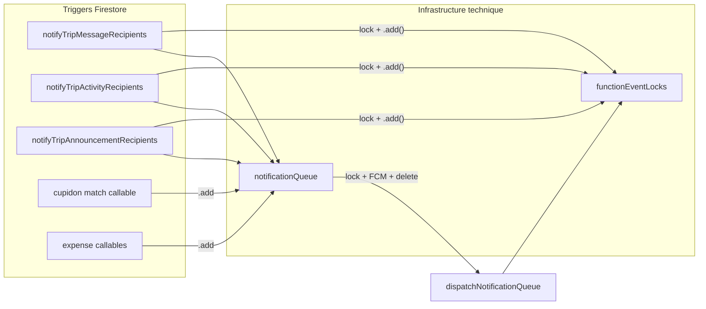
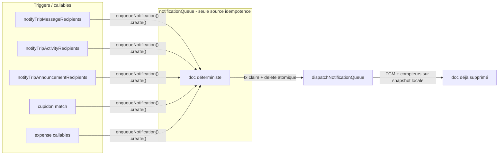
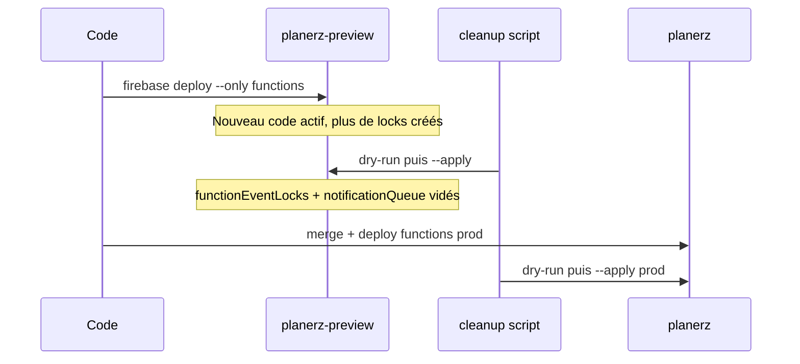

# Refactor idempotence notifications + nettoyage BDD

## Contexte et problème actuel



| Problème | Impact |
|----------|--------|
| `functionEventLocks` créé **au début** du traitement, jamais supprimé | Collection qui grossit indéfiniment, pas de statut succès/échec |
| Double garde-fou (`notify*` + `dispatch*`) | Redondance, deux collections à maintenir |
| `notificationQueue.add()` avec ID aléatoire | Retry upstream = doublons possibles en queue |
| Échec après lock | Retry bloqué définitivement (lock permanent) |

**Hors scope** (ne pas toucher) : `users/{uid}/tripNotificationCounters`, `trips/{tripId}/notificationReads`, `users/{uid}/fcmTokens` — état produit, pas dette technique.

---

## Architecture cible



**Principes :**
1. **Enqueue idempotent** : ID déterministe + `.create()` (échec silencieux si déjà en queue).
2. **Dispatch at most once** : suppression atomique du doc en transaction, traitement sur snapshot locale. Doc absent = no-op naturel.
3. **Suppression** de `markFunctionEventProcessedOnce` et de toute écriture vers `functionEventLocks`.
4. **(Optionnel, phase 2)** `collapse_key` FCM basé sur l'ID queue — défense en profondeur côté device.

---

## Changements par fichier

### 1. Module partagé d'enqueue — nouveau [`functions/notification_queue.js`](../../functions/notification_queue.js)

Deux helpers testables extraits de [`functions/index.js`](../../functions/index.js) :

**`buildNotificationQueueDocId(type, parts)`** — schéma d'IDs :

| Type | ID doc |
|------|--------|
| `trip_message` | `trip_message__{tripId}__{messageId}` |
| `trip_activity` | `trip_activity__{tripId}__{activityId}` |
| `trip_announcement` | `trip_announcement__{tripId}__{announcementId}` |
| `cupidon_match` | `cupidon_match__{tripId}__{matchId}__{notifiedUid}` |
| `expense_reimbursement_paid` | `expense_reimbursement_paid__{tripId}__{expenseId}` |
| `expense_reimbursement_unpaid` | `expense_reimbursement_unpaid__{tripId}__{expenseId}` |

**`enqueueTripNotification(db, { docId, payload })`**
- `db.collection('notificationQueue').doc(docId).create({ ...payload, createdAt })` — doc présent = à traiter, absent = consommé
- Catch `ALREADY_EXISTS` → return `{ enqueued: false }` (retry upstream sans doublon)
- Return `{ enqueued: true }` sinon

### 2. Triggers notify* — [`functions/index.js`](../../functions/index.js)

Fonctions concernées (lignes ~1468–1648) :
- `notifyTripMessageRecipients` — retirer `markFunctionEventProcessedOnce`, utiliser `enqueueTripNotification` avec `messageId` depuis `event.params`
- `notifyTripActivityRecipients` — idem avec `activityId`
- `notifyTripAnnouncementRecipients` — idem avec `announcementId`

### 3. Cupidon — [`functions/index.js`](../../functions/index.js)

- `sendCupidonMatchPush` (~1341) : ajouter param `matchId`, passer l'ID déterministe cupidon
- Appelant (~3847) : transmettre `matchId` déjà disponible dans le scope

### 4. Dépenses — [`functions/expense_settlement_recalc.js`](../../functions/expense_settlement_recalc.js)

Remplacer les deux `.add()` (~476 et ~586) par `enqueueTripNotification` :
- paid : `expenseId` = `createdExpenseId` retourné par la transaction
- unpaid : `expenseId` du settlement supprimé (connu avant `tx.delete`)

Importer le helper depuis `functions/notification_queue.js`.

### 5. Dispatcher — [`functions/index.js`](../../functions/index.js) `dispatchNotificationQueue` (~1377)

Remplacer `markFunctionEventProcessedOnce` par **`claimAndDeleteNotificationQueueDoc`** :

```javascript
// Transaction :
// - doc absent → retourne null (déjà consommé ou inexistant)
// - doc présent → supprime atomiquement, retourne les données
async function claimAndDeleteNotificationQueueDoc(db, ref) {
  return db.runTransaction(async (tx) => {
    const snap = await tx.get(ref);
    if (!snap.exists) return null;
    tx.delete(ref);
    return snap.data();
  });
}
```

Flux :
1. Claim + suppression transactionnelle → si `null`, return immédiat (idempotent)
2. Travailler sur la snapshot locale (données récupérées avant suppression)
3. Validation payload → return si invalide (doc déjà supprimé)
4. Présence, compteurs, FCM (inchangé)
5. **Pas de `snap.ref.delete()` en fin** — doc déjà supprimé en étape 1

**Choix assumé : at most once.** Si la fonction crashe après la suppression du doc et avant l'envoi FCM, la notif est perdue. Acceptable pour des notifications déclarées accessoires. En contrepartie : aucun doc stale, aucune collection fantôme, retry naturellement no-op.

### 6. Suppression du code mort — [`functions/index.js`](../../functions/index.js)

- Supprimer `markFunctionEventProcessedOnce` (~893–915)
- Aucune référence restante à `functionEventLocks`

### 7. Règles Firestore — [`firestore.rules`](../../firestore.rules)

Aucun changement requis : `notificationQueue` reste CF-only (`allow read, write: if false`). `functionEventLocks` n'a pas de règles client (Admin SDK uniquement).

### 8. Documentation — [`docs/notifications_architecture.md`](../notifications_architecture.md)

Ajouter une section **Idempotence** :
- schéma d'IDs déterministes
- cycle de vie (doc présent = en attente, doc absent = consommé)
- collections exclues du nettoyage
- choix at most once et ses implications

### 9. Script de nettoyage — nouveau [`scripts/cleanup_notification_infrastructure.js`](../../scripts/cleanup_notification_infrastructure.js)

Modèle CLI aligné sur [`scripts/migration/delete_ph_users.js`](../../scripts/migration/delete_ph_users.js) :
- `--key <service-account.json>` (obligatoire)
- `--dry-run` (défaut) / `--apply`
- `--verbose` (optionnel)

**Collections purgées :**
- `functionEventLocks` — tous les docs
- `notificationQueue` — tous les docs

**Implémentation :** pagination + batch delete (max 500 ops/batch), compteurs en sortie.

**Risque assumé :** docs `notificationQueue` présents au moment du cleanup = pushes non envoyées. Lancer à un moment creux, quelques minutes après le deploy functions.

**Règle :** le script `--apply` est exécuté par le PO (pas l'agent).

### 10. Tests — nouveau [`functions/notification_queue.test.js`](../../functions/notification_queue.test.js)

Tests unitaires Node (`node --test`) sur :
- `buildNotificationQueueDocId` pour chaque type
- `claimAndDeleteNotificationQueueDoc` : doc présent → retourne data + supprime ; doc absent → retourne null
- `enqueueTripNotification` : comportement `ALREADY_EXISTS` simulé (mock minimal)

Ajouter le fichier au script `test` dans [`functions/package.json`](../../functions/package.json).

### 11. (Optionnel, phase 2) FCM `collapse_key` — [`functions/index.js`](../../functions/index.js)

Dans `dispatchNotificationQueue`, sur chaque message FCM :
- `android.notification.tag` = docId queue
- `apns.headers['apns-collapse-id']` = docId queue

Pas bloquant pour le refactor principal.

---

## Ordre de déploiement



**Commandes PO (après merge) :**

```bash
# Preview
firebase deploy --only functions --project planerz-preview
node scripts/cleanup_notification_infrastructure.js --key ./preview-key.json
node scripts/cleanup_notification_infrastructure.js --key ./preview-key.json --apply

# Prod (après validation preview)
firebase deploy --only functions --project planerz
node scripts/cleanup_notification_infrastructure.js --key ./prod-key.json
node scripts/cleanup_notification_infrastructure.js --key ./prod-key.json --apply
```

Vérifier IAM Cloud Run sur les fonctions redéployées (redeploy existantes — check rapide recommandé).

**Flutter / règles Firestore / indexes :** aucun déploiement requis.

---

## Checklist de validation manuelle

- Envoyer un message → 1 seule entrée queue (ID déterministe), 1 push, doc queue supprimé après dispatch
- Créer activité / annonce / match cupidon / remboursement dépense → même comportement
- Console Firestore : `functionEventLocks` n'accueille plus de nouveaux docs après deploy
- Script dry-run : affiche les volumes à supprimer sans écrire
- `node --test` dans `functions/` vert

---

## Récapitulatif des fichiers touchés

| Fichier | Action |
|---------|--------|
| [`functions/index.js`](../../functions/index.js) | Refactor enqueue + dispatch, supprimer locks, cupidon |
| [`functions/expense_settlement_recalc.js`](../../functions/expense_settlement_recalc.js) | Enqueue déterministe |
| [`functions/notification_queue.js`](../../functions/notification_queue.js) | **Nouveau** — helpers partagés |
| [`functions/notification_queue.test.js`](../../functions/notification_queue.test.js) | **Nouveau** — tests |
| [`functions/package.json`](../../functions/package.json) | Ajouter test au script |
| [`scripts/cleanup_notification_infrastructure.js`](../../scripts/cleanup_notification_infrastructure.js) | **Nouveau** — purge BDD |
| [`docs/notifications_architecture.md`](../notifications_architecture.md) | Documenter idempotence |
