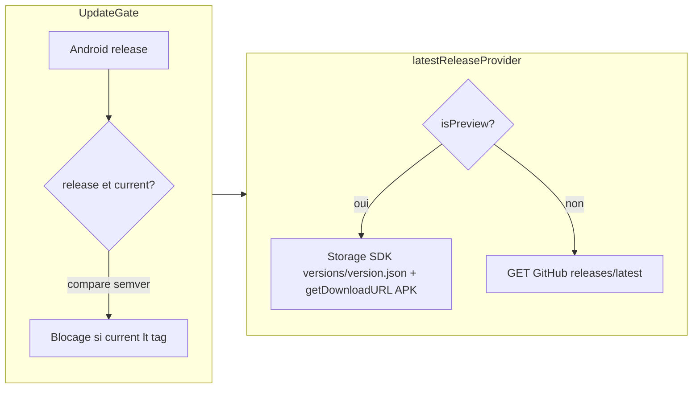

# Détection de mise à jour preview (alignée prod)

## Objectif

- En **preview** : même logique qu’en **prod** — comparaison semver ([`version_comparison.dart`](../../lib/app/update/version_comparison.dart)), écran bloquant si l’app est plus ancienne que la version distante.
- **Source distante preview** : **Firebase Storage** du projet **planerz-preview** (bucket `gs://planerz-preview.firebasestorage.app`), pas l’API GitHub. Pas de liens d’URL en dur dans le JSON : chemins d’objets **fixes dans le code** (comme d’autres assets Storage), lecture via le **SDK** (`getData` sur le JSON, `getDownloadURL` sur l’APK).

## Critique — ne pas impacter la prod

**Exigence** : tout ce qui concerne la preview **ne doit pas modifier le comportement** du flux prod (GitHub, cache prod, écran gate en prod). Aucun chemin de code prod ne doit dépendre de Firebase Storage pour la mise à jour, ni embarquer par erreur la logique preview.

**Fichiers à modifier** : **au minimum**, le fichier qui **route** prod vs preview (souvent le `FutureProvider` qui expose `RemoteRelease?`). C’est **normal et attendu** : ce fichier ne fait que dispatcher ; il n’a pas à rester « intouchable ». L’isolation porte sur **où vit la logique** (modules dédiés), pas sur l’absence de tout changement au routeur.

- **Réaliste** : extraire un **contrat commun** (ex. `Future<RemoteRelease?> fetchLatestRelease()` ou équivalent) et placer **deux implémentations dans des fichiers séparés** — une **uniquement** GitHub + SharedPreferences prod, une **uniquement** Storage preview + cache preview. Le code prod reste confiné au module GitHub ; le code Storage ne s’exécute **que** lorsque `FirebaseTarget.preview` est actif (ou équivalent).
- **Point d’injection** : **au moins un endroit** choisit l’implémentation (souvent **un seul** provider « routeur » qui `watch(firebaseTargetProvider)` et délègue, ou **overrides** `ProviderScope` dans l’entrée app preview). Objectif : ce point reste **mince** (routage uniquement, pas de logique Storage/GitHub inline).
- **Compilation prod vs preview** : avec une seule codebase et `FirebaseTarget` au **runtime** (comme aujourd’hui), la séparation se fait par **branche conditionnelle dans le provider** ou par **deux sous-providers** + agrégation — les deux respectent l’exigence si la branche prod **appelle uniquement** l’implémentation GitHub. Les **imports conditionnels** Dart (`import 'x.dart' if (dart.library...) 'y.dart'`) permettent d’aller plus loin (binaire différent, pas de référence Storage dans le module prod), au prix de complexité (flavors / définitions).
- **Non-régression** : revue de code ciblée sur « aucun import / aucun appel Storage » dans le fichier de fetch prod ; test manuel ou test unitaire du fetch GitHub inchangé ; build **prod** analysée pour s’assurer qu’aucune dépendance nouvelle n’est requise côté prod si vous isolez les imports (option avancée).

En résumé : **oui**, une implémentation preview **injectée** et **isolée dans des fichiers dédiés** est possible et recommandée ; le **fichier de routage** est précisément celui qu’il faut adapter (minimalement) pour enchaîner prod/preview — et **uniquement** le routage y figure, pas la logique Storage ni GitHub.

## Stockage dans le bucket (contrat produit)

Tout sous le préfixe **`versions/`** :

- **`versions/version.json`** — métadonnées : **uniquement** le champ `tag` (semver, mêmes règles que les tags GitHub ; `v` optionnel côté parseur).
- **`versions/planerz.preview.apk`** — binaire preview ; nom **constant**.

Exemple de contenu pour `version.json` (à jour quand tu publies une nouvelle build « courante ») :

```json
{
  "tag": "0.2.0-beta1"
}
```

L’APK n’est **pas** référencé par URL dans ce fichier : l’application construit la référence Storage vers `versions/planerz.preview.apk` et obtient une URL de téléchargement au moment voulu.

## Comportement cible dans le code



- [`lib/app/update/update_gate.dart`](../../lib/app/update/update_gate.dart) : reste **agnostique** de la source (consomme seulement `RemoteRelease`) ; idéalement **aucune** logique preview dans ce fichier.
- Agrégateur (ex. [`latest_release_provider.dart`](../../lib/app/update/latest_release_provider.dart) ou équivalent) : **uniquement** le routage `preview` → impl. Storage / `prod` → impl. GitHub ; la logique métier reste dans des **fichiers séparés** (voir section **Critique — ne pas impacter la prod** ci-dessus).
- Module preview dédié (ex. `preview_storage_release.dart`) : constantes `versions/version.json` et `versions/planerz.preview.apk`, `FirebaseStorage` aligné sur le bucket preview (même idée que [`trips_repository.dart`](../../lib/features/trips/data/trips_repository.dart) : `planerz-preview.firebasestorage.app`), parse JSON → [`RemoteRelease`](../../lib/app/update/remote_release.dart) avec `tag` + URL d’APK résolue par le SDK.
- Module prod dédié (ex. `github_latest_release_fetcher.dart`) : **copie / extraction** du flux GitHub + cache prod actuel, **sans** y mélanger Storage.

**Équivalent prod** : en prod la cible GitHub est fixée dans le code ; en preview la cible est le **couple de chemins** `versions/version.json` + `versions/planerz.preview.apk` dans le bucket preview — pas d’ID Drive ni de `dart-define` pour un fichier manifest externe.

Si la lecture Storage échoue (réseau, règles, fichier absent), le provider renvoie `null` : **pas** de mise à jour forcée.

## Ce que tu dois faire côté publication

1. Uploader / mettre à jour **`versions/planerz.preview.apk`** dans la console Storage du projet preview.
2. Éditer **`versions/version.json`** pour y mettre le **`tag`** de la build « à imposer » (semver cohérent avec [`pubspec.yaml`](../../pubspec.yaml) / versioning d’APK).
3. **Règles Storage** : la mise à jour du fichier [`storage.rules`](../../storage.rules) dans le repo est une **tâche d’implémentation** (voir todo `storage-rules`) ; le product owner se charge uniquement du **déploiement** Firebase Storage une fois le fichier fusionné.

## Règles Storage partagées (preview et prod)

Le dépôt n’a qu’**un** [`storage.rules`](../../storage.rules), déployé sur **chaque** projet Firebase (preview, prod). Ce n’est **pas gênant** d’y déclarer des chemins comme `versions/**` alors que le bucket **prod** n’a peut‑être **aucun** objet sous `versions/` :

- Les règles ne s’évaluent que lorsqu’une **requête** vise un chemin donné ; l’absence d’objets sur prod ne casse rien et n’ouvre pas d’accès fantôme.
- Si personne ne lit `versions/...` en prod, ce bloc ne change pas le comportement effectif du bucket prod.
- Quand un jour un objet existerait sous `versions/` en prod, ce seraient **ces** règles qui s’appliqueraient — à garder en tête si tu réutilises ce préfixe ailleurs.

## Vérifications recommandées

- `flutter analyze` sur `lib/app/update/`.
- APK preview installé avec une version **strictement inférieure** au `tag` du JSON → affichage du gate ; le bouton de téléchargement doit ouvrir une URL résolue par Storage vers `planerz.preview.apk`.
- Après publication : incrémenter uniquement **`tag`** dans `version.json` quand la nouvelle APK est en place.

## Limites / points de vigilance

- **Règles Storage** : refus de lecture → échec silencieux côté gate (null).
- **Cache** : le provider met en cache ~1 h ; pour tester un changement de `tag` immédiatement, vider le cache ou attendre (ou ajuster en dev si besoin).
