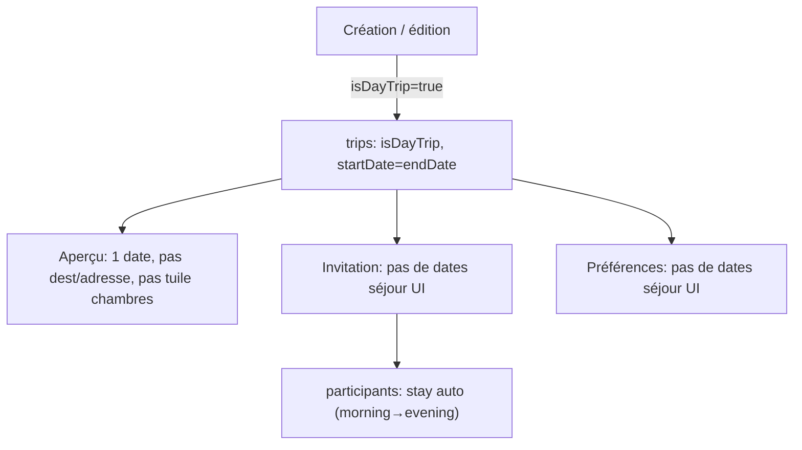

# Plan — Voyage / sortie « à la journée »

## Principe données (minimal)

Un seul champ Firestore nouveau sur `trips/{tripId}` :

- `isDayTrip: bool` (absent ou `false` = comportement actuel inchangé)

Réutilisation des champs existants pour le calendrier :

| Champ existant | Comportement si `isDayTrip` |
|---|---|
| `startDate` / `endDate` | Même jour calendaire |
| `tripStartDayPart` / `tripEndDayPart` | **Non écrits** (supprimés si présents) — les repas ne bornent pas le voyage |
| `destination` | Chaîne vide (non collectée) |
| `address` | Chaîne vide (pas d’hébergement) |
| `stayStartDateKey`… sur participants | Conservés en base via la logique serveur existante (`defaultStayForTrip` gère déjà le cas single-day) ; **aucun champ participant nouveau** |



## 1. Modèle et persistance

### [`lib/features/trips/data/trip.dart`](../../lib/features/trips/data/trip.dart)
- Ajouter `final bool isDayTrip` (défaut `false`).
- Lire `data['isDayTrip'] == true` dans `fromMap`.
- Exposer dans `toMap` si `true`.

### [`lib/features/trips/data/trips_repository.dart`](../../lib/features/trips/data/trips_repository.dart)

**`createTrip`** — nouveau paramètre `bool isDayTrip = false` :
- Si `isDayTrip` : écrire `isDayTrip: true`, `destination: ''`, `startDate` = `endDate` = jour choisi, **ne pas** écrire `tripStartDayPart` / `tripEndDayPart`.
- Sinon : comportement actuel inchangé.

**`updateTrip`** — nouveau paramètre `bool? isDayTrip` :
- Persister le flag.
- Si `isDayTrip == true` : forcer `destination` et `address` à `''`, `endDate` = `startDate`, supprimer les day parts (`FieldValue.delete()`).
- Si passage `true → false` : rétablir l’UI multi-jours côté client (plage par défaut) et réécrire les day parts comme aujourd’hui.

### [`lib/features/trips/data/invite_join_context.dart`](../../lib/features/trips/data/invite_join_context.dart) + parsing dans `trips_repository.dart`
- Ajouter `final bool isDayTrip`.
- Parser depuis la réponse Cloud Function.

### [`functions/index.js`](../../functions/index.js) — `getInviteJoinContext`
- Retourner `isDayTrip: data.isDayTrip === true` dans la réponse (ligne ~2472).

> **Déploiement requis** (à exécuter par le PO) :
> - `firebase deploy --only functions:getInviteJoinContext --project <preview|prod>`
> - `firebase deploy --only firestore:rules --project <preview|prod>` (voir §1b)

### 1b. Règles Firestore — [`firestore.rules`](../../firestore.rules)

**Risque identifié** : les mises à jour d’infos générales du voyage passent par une liste blanche de clés (`hasOnly`). Sans modification, toute sauvegarde incluant `isDayTrip` sera **refusée** pour les membres ayant `canEditTripGeneralInfo` mais n’étant pas propriétaire (co-admins, etc.). Le propriétaire (`ownerId`) contourne cette liste, ce qui masquerait le bug en tests créateur-only.

Bloc concerné (~l.595) :

```javascript
canEditTripGeneralInfo(tripId)
&& request.resource.data.diff(resource.data).affectedKeys().hasOnly([
  'title',
  'destination',
  'address',
  'linkUrl',
  'startDate',
  'endDate',
  'tripStartDayPart',
  'tripEndDayPart',
  // ← ajouter 'isDayTrip' ici
])
```

**Modification** : ajouter `'isDayTrip'` à cette liste. Pas de validation métier supplémentaire (masquage UI seulement, pas de règles strictes côté backend).

**Création** (`allow create`) : pas de liste blanche sur les champs — `isDayTrip` à la création ne pose pas de problème.

**Lecture** : aucune règle à changer (`get` / `list` inchangés).

## 2. Widget date unique (partagé)

Nouveau fichier léger [`lib/features/trips/presentation/trip_single_day_date_field.dart`](../../lib/features/trips/presentation/trip_single_day_date_field.dart) :
- Un bouton date (réutiliser le style de [`trip_calendar_stay_bounds_field.dart`](../../lib/features/trips/presentation/trip_calendar_stay_bounds_field.dart)).
- Pas de dropdown repas.
- Callback `ValueChanged<DateTime>`.

Helper date affichage dans [`lib/features/trips/presentation/trip_date_format.dart`](../../lib/features/trips/presentation/trip_date_format.dart) :
- `formatTripSingleDayDate(context, date)` pour l’aperçu (évite « du 17 juin au 17 juin »).

## 3. Écran de création — [`trip_create_page.dart`](../../lib/features/trips/presentation/trip_create_page.dart)

- État local `bool _isDayTrip = false`.
- `SwitchListTile` (même pattern que [`trip_settings_general_page.dart`](../../lib/features/trips/presentation/trip_settings_general_page.dart)) pour activer « À la journée ».
- **Si `_isDayTrip`** :
  - Masquer le champ Destination.
  - Remplacer `TripCalendarStayBoundsField` par `TripSingleDayDateField`.
  - Validation : titre + nom créateur seulement.
  - Soumission : `createTrip(isDayTrip: true, destination: '', startDate: endDate: pickedDay, tripStartDayPart/tripEndDayPart: null)`.
- **Sinon** : formulaire actuel inchangé.

## 4. Aperçu — [`trip_overview_page.dart`](../../lib/features/trips/presentation/trip_overview_page.dart)

### Mode lecture
- Bannière : **ne pas afficher** la ligne destination si `trip.isDayTrip` (au lieu de « Destination inconnue »).
- Dates : `formatTripSingleDayDate` au lieu de `formatTripDateRange`.
- **Hébergement** : masquer le champ adresse en édition ; en lecture, ne pas proposer l’itinéraire basé sur `_trip.address` (`showDirections` = false quand `isDayTrip`, même si lien Maps présent via adresse — le lien URL reste affichable s’il existe).
- **Tuile Chambres** : ne pas afficher `_CategoryAccessTile` « Chambres » (`tripOverviewTileRooms`, ~l.1330) quand `_trip.isDayTrip`. **UI uniquement** — pas de règle backend, la route `/rooms` reste accessible si l’URL est saisie manuellement. La tuile Activités occupe alors toute la largeur de la rangée (supprimer le `Expanded` jumeau et le `SizedBox` d’espacement).

### Mode édition (tag modifiable)
- `SwitchListTile` « À la journée » (initialisé depuis `trip.isDayTrip`).
- Bascule ON : masquer destination + adresse, passer à `TripSingleDayDateField` (jour = `startDate` ou aujourd’hui).
- Bascule OFF : réafficher destination + `TripCalendarStayBoundsField` + adresse (plage par défaut depuis le jour courant, comme création multi-jours).
- `_save()` : transmettre `isDayTrip` à `updateTrip` avec la logique décrite en §1.

## 5. Invitation — [`invite_join_page.dart`](../../lib/features/trips/presentation/invite_join_page.dart)

Quand `ctx.isDayTrip` :
- Ne pas afficher l’onglet / section « Dates de présence » dans `TripMemberStayOptionsEditor` (voir §6).
- `_completeInviteWithDetails` : **sauter** validation `TripMemberStay` et l’appel `updateParticipantProfile(stay: …)` — le serveur applique déjà `defaultStayForTrip` à l’adhésion.
- Conserver cupidon + visibilité téléphone.

## 6. Préférences participant — [`trip_member_preferences_page.dart`](../../lib/features/trips/presentation/trip_member_preferences_page.dart)

- Passer `showStayDates: !trip.isDayTrip` à `TripMemberStayOptionsEditor`.
- Masquer `_updateStayLive` côté UI (le callback n’est pas proposé).

### [`trip_member_stay_options_editor.dart`](../../lib/features/trips/presentation/trip_member_stay_options_editor.dart)
- Nouveau paramètre `bool showStayDates` (défaut `true`).
- Si `false` : pas de `TabBar`, afficher directement l’onglet options (cupidon, téléphone) ; `TabController` inutile → initialiser avec `length: 1` ou conditionner sa création.

## 7. Localisation (4 ARB de référence)

Clés minimales à ajouter dans `app_fr`, `app_fr_FR`, `app_en`, `app_en_US` :

| Clé | FR (exemple) |
|---|---|
| `tripDayTripLabel` | À la journée |
| `tripCreateSingleDayDateLabel` | Date de la sortie |
| `tripsCreateValidationRequiredDayTrip` | Titre et votre nom sont obligatoires |

- Adapter `tripsCreateValidationRequired` uniquement si le message actuel reste utilisé pour le mode multi-jours (sinon séparer les deux messages comme ci-dessus).

## 8. Hors périmètre strict (non modifié sauf si souhaité ensuite)

- Liste des voyages ([`trips_page.dart`](../../lib/features/trips/presentation/trips_page.dart)) : la destination vide ne s’affichera déjà pas ; la date pourrait encore montrer une plage redondante — correction possible en une ligne via `isDayTrip` mais **hors des 4 fichiers demandés**.
- Page chambres (`/rooms`) et données chambres : inchangées côté backend ; seul le raccourci overview est masqué pour les sorties à la journée.

## 9. Vérification

- `flutter analyze` après les edits Dart.
- Scénarios manuels :
  1. Créer une sortie à la journée → 1 date, pas de destination, overview sans dest/adresse ni tuile Chambres.
  2. Éditer l’aperçu : basculer ON/OFF le tag et vérifier champs + sauvegarde (**propriétaire et co-admin** si applicable).
  3. Rejoindre via invitation : pas de dates de séjour, cupidon/téléphone OK.
  4. Préférences voyage : pas d’onglet dates pour un voyage tagué.
  5. Voyage multi-jours existant : aucune régression.
