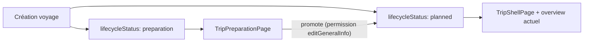

# Mode « en préparation » pour les voyages (phase 1)

## Objectif

Permettre de créer un voyage sans dates ni destination, dans un état transitoire **« en préparation »**, puis de le promouvoir en **« prévu »** pour accéder au parcours habituel (shell, overview, onglets).

En phase 1 :
- Création avec choix « Prévu » / « En préparation »
- Page dédiée minimaliste hors shell pour les voyages en préparation
- Promotion unidirectionnelle vers « prévu » (permission `editGeneralInfo`)
- Navigation cohérente depuis la liste, les liens directs et les invitations
- Aucune modification de l’overview ni des onglets existants

## Stockage Firestore

**Chemin :** champ racine `lifecycleStatus` sur `trips/{tripId}`.

| Valeur Firestore | Signification UI | Rétrocompatibilité |
|---|---|---|
| `"planned"` | Prévu (comportement actuel) | Champ absent = `"planned"` |
| `"preparation"` | En préparation | — |

Pas de sous-collection : cohérent avec `title`, `startDate`, `destination`, etc.

**Document trip en mode préparation :**
- `lifecycleStatus: 'preparation'`
- `destination: ''` (chaîne vide)
- Pas de `startDate`, `endDate`, `tripStartDayPart`, `tripEndDayPart`

**Document participant créateur :** pas de champs de séjour (`startDateKey`, `startDayPart`, `endDateKey`, `endDayPart`) tant que le voyage est en préparation.



## 1. Modèle et repository

**Nouveau fichier** [`lib/features/trips/data/trip_lifecycle_status.dart`](../../lib/features/trips/data/trip_lifecycle_status.dart)
- `enum TripLifecycleStatus { planned, preparation }`
- Helpers `tripLifecycleStatusFromFirestore(String?)` / `tripLifecycleStatusToFirestore(...)`
- Extension `bool get isInPreparation` sur `Trip`

**Modifier** [`lib/features/trips/data/trip.dart`](../../lib/features/trips/data/trip.dart)
- Ajouter `lifecycleStatus` (défaut `planned` si absent dans `fromMap`)
- Sérialiser dans `toMap` uniquement si `preparation`

**Modifier** [`lib/features/trips/data/trips_repository.dart`](../../lib/features/trips/data/trips_repository.dart)

`createTrip` :
- Nouveau param `TripLifecycleStatus lifecycleStatus = TripLifecycleStatus.planned`
- Retourner `Future<String>` (ID du doc créé) au lieu de `Future<void>`
- Si `preparation` : écrire `lifecycleStatus`, `destination: ''` ; omettre dates et day-parts ; créer le participant créateur sans champs de séjour
- Si `planned` : comportement inchangé

Nouvelle méthode `promoteTripToPlanned({required String tripId})` :
- Même contrôle de permission que [`updateTrip`](../../lib/features/trips/data/trips_repository.dart) (`editGeneralInfoMinRole` via `resolveTripPermissionRole`)
- `update({ 'lifecycleStatus': 'planned' })` — ne modifie aucun autre champ

## 2. Règles Firestore

**Modifier** [`firestore.rules`](../../firestore.rules) — bloc `canEditTripGeneralInfo`, ajouter `'lifecycleStatus'` à la liste `hasOnly([...])` (lignes ~596–605).

Le créateur (`ownerId`) peut déjà tout modifier ; ce changement couvre les co-admins disposant de la permission « infos générales ».

## 3. Création de voyage

**Modifier** [`lib/features/trips/presentation/trip_create_page.dart`](../../lib/features/trips/presentation/trip_create_page.dart)

En tête du formulaire, un `SegmentedButton<TripLifecycleStatus>` (pattern existant : dépenses, repas, etc.) :
- **Prévu** : formulaire actuel (titre, destination, nom créateur, dates)
- **En préparation** : masquer destination et `TripCalendarStayBoundsField` ; validation = titre + nom créateur

À la soumission :
- `planned` → `createTrip(...)` avec dates et destination comme aujourd’hui
- `preparation` → `createTrip(lifecycleStatus: preparation, destination: '', startDate: null, endDate: null, ...)`

Navigation post-création (remplace le `pop()` actuel) :
- `preparation` → `context.go('/trips/$tripId/preparation')`
- `planned` → `context.go('/trips/$tripId/overview')`

## 4. Page minimaliste

**Nouveau fichier** [`lib/features/trips/presentation/trip_preparation_page.dart`](../../lib/features/trips/presentation/trip_preparation_page.dart)

Page autonome — pas de `TripShellPage`, pas de bottom nav :
- `Scaffold` : AppBar (titre du voyage, retour vers `/trips`)
- Corps : titre du voyage + bouton « Passer en mode prévu »
- Données via `tripStreamProvider(tripId)`
- Bouton visible si permission `editGeneralInfo` (`resolveTripPermissionRole` + `isTripRoleAllowed`, comme l’overview)
- Au clic : `promoteTripToPlanned` puis `context.go('/trips/$tripId/overview')`
- Si le stream indique déjà `planned` : redirect automatique vers l’overview

Aucune modification de [`trip_overview_page.dart`](../../lib/features/trips/presentation/trip_overview_page.dart) ni des autres onglets.

## 5. Routage et navigation

### Helper partagé

Nouveau fichier [`lib/features/trips/presentation/trip_entry_route.dart`](../../lib/features/trips/presentation/trip_entry_route.dart) :

```dart
String tripEntryPath(String tripId, TripLifecycleStatus status) =>
    status == TripLifecycleStatus.preparation
        ? '/trips/$tripId/preparation'
        : '/trips/$tripId/overview';
```

Point d’entrée unique pour ouvrir un voyage (liste, invitation, redirect routeur).

### Routeur

**Modifier** [`lib/app/router.dart`](../../lib/app/router.dart)

**Redirect `/trips/:tripId`** — remplacer le redirect sync vers `/overview` (l. ~155–159) par une lecture Firestore du doc trip et une redirection vers `tripEntryPath(tripId, status)`. Implémentation via redirect async go_router ou route intermédiaire qui résout le statut avant navigation. Objectif : les liens nus `/trips/{id}` (bookmark, retour navigateur) n’affichent jamais le shell pour un voyage en préparation.

**Route `preparation`** — sœur du `StatefulShellRoute`, au même niveau que `settings` / `participants` :

```dart
GoRoute(
  path: 'preparation',
  builder: (context, state) => TripPreparationPage(
    tripId: state.pathParameters['tripId']!,
  ),
),
```

### Garde-fou shell

**Modifier** [`lib/features/trips/presentation/trip_shell_page.dart`](../../lib/features/trips/presentation/trip_shell_page.dart)

Complément au redirect routeur : couvre les deep links directs vers une branche shell (`/overview`, `/messages`, etc.).

Dans le `data:` de `tripAsync.when`, avant `return TripScope(...)` :
- Si `trip.isInPreparation` : `WidgetsBinding.instance.addPostFrameCallback` + `context.go(tripEntryPath(...))`, afficher un loader (même pattern que le redirect `trip == null`)
- Voyages `planned` : rendu inchangé

Les routes hors shell (`/settings`, `/participants`, `/preferences`, etc.) restent accessibles pour les voyages en préparation — pas de garde-fou supplémentaire en phase 1.

### Liste des voyages

**Modifier** [`lib/features/trips/presentation/trips_page.dart`](../../lib/features/trips/presentation/trips_page.dart)

- Passer `onOpenTrip` de `ValueChanged<String>` à `ValueChanged<Trip>`
- Navigation : `context.push(tripEntryPath(trip.id, trip.lifecycleStatus))`
- Carte voyage : si `trip.isInPreparation`, afficher `l10n.tripLifecyclePreparationLabel` à la place de `formatTripDateRange(...)`. Classement timeline inchangé (voyage sans dates → onglet « En cours »).

### Invitation

**Cloud Function** [`functions/index.js`](../../functions/index.js) — `getInviteJoinContext` : ajouter `lifecycleStatus: data.lifecycleStatus ?? 'planned'` à la réponse.

**Modèle** [`invite_join_context.dart`](../../lib/features/trips/data/invite_join_context.dart) : champ `TripLifecycleStatus lifecycleStatus`.

**Repository** [`trips_repository.dart`](../../lib/features/trips/data/trips_repository.dart) — `_parseInviteJoinContext` : parser ce champ (défaut `planned`).

**UI** [`invite_join_page.dart`](../../lib/features/trips/presentation/invite_join_page.dart) :
- Bouton « Ouvrir le voyage » : `go(tripEntryPath(widget.tripId, _context!.lifecycleStatus))` à la place du `go('/overview')` en dur
- Masquer `TripCalendarStayBoundsField` lorsque `lifecycleStatus == preparation` ; adapter `_stayDraft` et la soumission join (vérifier compatibilité CF `joinTripWithInvite` avec participant sans champs séjour)

## 6. Localisation

Nouvelles clés dans les 4 ARB de référence (`app_fr`, `app_fr_FR`, `app_en`, `app_en_US`) :
- `tripsCreateLifecycleLabel` — « Type de voyage »
- `tripsCreateLifecyclePlanned` — « Prévu »
- `tripsCreateLifecyclePreparation` — « En préparation »
- `tripsCreateValidationRequiredPreparation` — titre + nom requis
- `tripPreparationPromoteAction` — « Passer en mode prévu »
- `tripLifecyclePreparationLabel` — « En préparation » (substitut ligne dates sur la carte liste)

Pas de texte d’aide supplémentaire. Regénérer l10n (`flutter gen-l10n` ou build habituel).

## 7. Hors scope phase 1

- Saisie destination/dates lors de la promotion en « prévu » (l’overview peut rester incomplet)
- Retour arrière preparation ← planned
- Garde-fous sur les routes hors shell
- Onglet ou filtre dédié « En préparation » dans la liste

## 8. Vérification

`flutter analyze` sur les fichiers touchés.

Scénarios manuels :
1. Créer un voyage « Prévu » → overview classique, shell intact
2. Créer un voyage « En préparation » → page minimaliste, pas de nav ; participant sans champs séjour
3. Promouvoir → overview classique (dates/lieu éventuellement vides)
4. Ouvrir depuis la liste → page minimaliste ; carte affiche « En préparation »
5. `/trips/{id}/overview` sur voyage en préparation → redirect `/preparation`
6. `/trips/{id}` sans suffixe → redirect direct `/preparation`, sans flash shell
7. Invitation sur voyage en préparation → pas d’UI séjour ; « Ouvrir le voyage » → page minimaliste
8. Co-admin `editGeneralInfo` voit le bouton promote ; membre sans permission non
9. Notification push → `/messages` → garde-fou shell vers `/preparation`

## 9. Déploiement

Séquence recommandée (backend avant client pour éviter toute régression invite ou promotion) :

1. **Firestore rules** — `firebase deploy --only firestore:rules --project <preview|prod>`
2. **Cloud Function** — `firebase deploy --only functions:getInviteJoinContext --project <project>`
3. **App Flutter** — build / release habituelle

Après redéploiement CF : vérifier IAM Cloud Run (`allUsers` + `roles/run.invoker` sur le service concerné).
